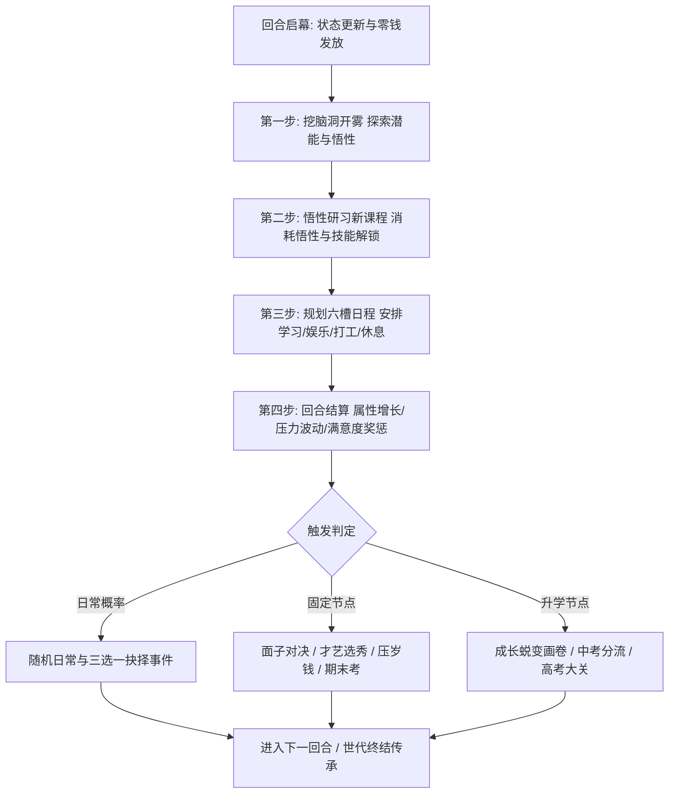

# 01. 系统定位与玩法总览 (System Positioning & Overview)

> 对应原设计文档：第0章 项目定位、第1章 玩法总览

---

## 一、 项目定位 (Project Positioning)

### 1.1 创作背景与宗旨
- **项目性质**：个人自娱自乐开源项目，深度致敬与复刻墨鱼玩游戏于 2018 年推出的现象级模拟养成单机游戏《中国式家长》（Chinese Parents）。
- **核心情感内核**：**“养一个娃，从呱呱坠地到高考成人，再到成家立业，把积攒一生的希望与底蕴传递给下一代。”** 体验中国当代几代人通过知识改变命运、拼搏实现“阶层跨越”的心路历程。
- **文化表达风格**：全原创叙事文案，深度挖掘 80/90/00 后共同的成长回忆。以幽默、自嘲、温暖且偶尔“扎心”的基调，还原中国式家庭关怀、应试压力、亲戚攀比、纯真友谊与时代变迁。

### 1.2 表现形态与技术选型
- **形态规格**：纯前端单页 Web 应用程序（H5 SPA），**手机竖屏体验优先**（基准视口宽度 375px~430px），同时全面兼容平板与桌面现代浏览器宽屏自适应居中。
- **极简工程哲学**：
  - **零构建工具 (No Bundlers)**：不依赖 Webpack、Vite、Rollup 等复杂的编译打包管道，源码即生产代码。
  - **零第三方库 (Zero External Dependencies)**：不引入 React/Vue 等重型框架，不用任何外部 CSS/JS 库，纯手写原生 HTML5、CSS3 与原生现代 JavaScript。
  - **原生音效合成 (Web Audio API)**：不引入庞大冗长的高清音频文件，基于浏览器内建的 `AudioContext` 动态合成晶莹剔透的操作音效（按键点击、弹窗叮当、翻牌音效、大考钟鸣）。
  - **本地自主可控持久化 (Local Persistence)**：游戏存档与世代家谱全量存储于浏览器的 `localStorage` 中，无须登录，离线即玩，随开随关，刷新即存，永不丢档。
  - **静态边缘分发**：直接部署于 Cloudflare Pages 全球 CDN 静态网络，实现零成本、免运维、毫秒级首屏加载（已发布至 `https://chinese-parent.pages.dev`）。

### 1.3 视觉画风规范
- **素材独立性**：严格避免抓取或盗用原作商业美术素材，完全依靠 **Emoji 符号 + 现代 CSS3 矢量图形与渐变** 进行角色、道具与场景的可视化呈现。
- **色调与质感**：
  - 主基调采用温暖活泼的米黄 (`#fffdf8`)、金黄 (`#f6ad55`)、落霞橙 (`#ed8936`) 与纸质羊皮卷质感；
  - 辅以现代卡片化立体投影、微毛玻璃磨砂（Glassmorphism）、微交互回弹动画（Bounce/Pop）；
  - 追求“清爽、护眼、治愈”的卡通绘本风貌。

---

## 二、 玩法总览 (Gameplay Overview)

### 2.1 一句话核心玩法
**你将扮演一个出生在中国普通家庭的孩子，在约 58 个回合的生命周期中，每回合通过“挖脑洞”探索潜能，安排“人生六件事”，在父母期望与课业压力之间寻求平衡，通过悟性研习知识、培养拿手特长、在亲友攀比与才艺选秀中为家庭争面子，冲刺高考，步入大学与职场，最终成家生子，将累积的财富、智慧与家族特长遗传给后代。**

### 2.2 每回合核心循环圈 (Turn Loop)

游戏以回合制展开，每回合代表现实世界约半年的时光（一个学期或寒暑假）。回合内严格遵循以下五步闭环：

#### 回合内关键阶段详解：
1. **启幕与发薪 (Turn Initialization)**：
   - 刷新行动力上限（基础 100 点 + 上回合状态修正）；
   - 家长根据家族社会门第发放零花钱（基础 30~130 元）；
   - 重置并刷新本回合的 6×6 脑洞潜能矩阵。
2. **脑洞深潜 (Brain Exploration)**：
   - 在 36 格的脑洞面板中翻开未知格子，探寻发光的悟性灯泡、五大单项属性球、连锁炸弹、补能闪电以及通往下一层的钥匙。
3. **知识研习 (Knowledge Mastery)**：
   - 查看技能树中当前阶段开放的主副学科。五维属性越高，所对应的研习悟性价格折扣越大；研习后新技能永久解锁并进入日程动作池。
4. **日程决策 (Schedule Execution)**：
   - 从可用动作池（学习、娱乐、兼职、休息、索取）中自由拖入或点选 6 个槽位。
   - 核心矛盾：高强度学习提升掌握度与满意度，但导致压力暴涨；沉迷娱乐虽然降压，但会导致父母满意度骤降遭受惩罚。
5. **阶段演进与终局传承 (Evolution & Inheritance)**：
   - 在特定岁数跨越幼升小、小升初、初升高、高考、大学、就业、相亲，最终生成“家族功绩录”，开启更强大的下一代。

---

## 三、 遵循原作的核心机制对比一览

| 核心维度 | 原版《中国式家长》(墨鱼玩) | 本 H5 版复刻实现 | 机制对齐度 |
|---|---|---|:---:|
| **人生阶段** | 婴儿期至高考（约48回合）+ 结局结算 | 婴儿期至成家立业（共58回合）+ 7次成长画卷 | 🌟 **完全对齐并扩充后续成人期** |
| **基础属性** | 智商、情商、体魄、记忆力、想象力、魅力 | 智商(iq)、情商(eq)、记忆(mem)、想象(img)、体魄(phy)、魅力(cha) | 🌟 **100% 对齐** |
| **悟性机制** | 挖脑洞获得，属性越高学技能越便宜 | 动态折扣算法：基础费用 ÷ 属性折扣，最高打骨折 | 🌟 **100% 对齐** |
| **脑洞玩法** | 6×6 格子，含炸弹、同色连锁、闪电、下层钥匙 | 6×6 矩阵开雾，炸弹范围爆炸，闪电回体，钥匙下层+50行动 | 🌟 **100% 对齐** |
| **日程槽位** | 6 格槽位，学习/娱乐自由组合，已掌握技能可重复排入 | 严格 6 槽位，已掌握课程无限制重复排入，支持自动智能排满 | 🌟 **100% 对齐** |
| **面子对决** | 亲友攀比对决，卡牌伤害呈“7的倍数”梯级递增 | 7/49/343/2401 伤害体系，支持战术撤退 | 🌟 **100% 对齐** |
| **特长选秀** | 4场选秀舞台，竞逐大奖获得海量悟性与面子 | 幼儿园/小学/初中/高中 4 场大奖赛，冠军奖 500 悟性+200 面子 | 🌟 **100% 对齐** |
| **索取系统** | 满意度≥80%给次数，消耗面子和概率向父母要物品 | 严格判定满意度、面子阈值与 25%~75% 成功率曲线 | 🌟 **100% 对齐** |
| **代际传承** | 家族特长图鉴、属性按比例遗传、零花钱阶层继承 | 家族特长图鉴自动成长、父母属性 18% 折算、门第阶层遗传 | 🌟 **100% 对齐** |
