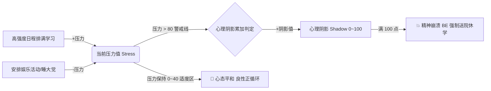

# 03. 数值模型与代际遗传系统 (Numerical Models & Genetics)

> 对应原设计文档：第3章 数值系统 (3.1 五维属性、3.2 资源与状态数值、3.3 遗传与世代传承)

---

## 一、 六维心智成长属性 (Primary Attributes)

游戏将角色心智成长抽象为 **5 项常规心智属性** 与 **1 项特殊魅力属性**。心智属性不仅是高考全科算分的基础乘数，更是解锁数十种社会顶尖职业、降低课程研习成本的先决条件。

| 属性名称 | 标识符 | 图标 | 主导学科与方向 | 核心获取途径 | 对研习成本的影响 |
|:---|:---:|:---:|:---|:---|:---|
| **智商** | `iq` | 📐 | 数学、物理、计算机程序、医学、逻辑分析 | 脑洞蓝色球、数理课程、棋类益智 | 大幅降低所有理科、程序课程的研习悟性 |
| **情商** | `eq` | ❤️ | 语文、社交人际、处事周全、文学、管理 | 脑洞粉色球、陪伴交流、班干部工作 | 大幅降低文综、社交课程悟性，提升交际成功率 |
| **记忆力** | `mem` | 🧠 | 英语、文综政史地、应试真题背诵、医学条规 | 脑洞棕色球、反复读背、英语语法练习 | 大幅降低外语、文综、背诵类课程悟性 |
| **想象力** | `img` | 🎨 | 美术设计、作文抒情、创意研发、影视导演 | 脑洞紫色球、画画、手工玩具、艺术欣赏 | 大幅降低艺术、创意类课程的研习悟性 |
| **体魄** | `phy` | 💪 | 体育中考、体能健康、熬夜抗疲劳、竞技体育 | 脑洞绿色球、户外活动、跑步器械 | 提升抗压力韧性，降低生病与虚弱概率 |
| **魅力** | `cha` | ⭐ | 演艺明星、恋爱羁绊、大众喜爱度、商务公关 | 专属时尚课程、高端活动、外貌事件 | **特殊属性**（无法通过脑洞挖掘获取），纯靠课程与特殊事件 |

---

## 二、 动态资源与身心状态系统 (Resources & State Mechanics)

角色在每一回合中都处于多重资源的博弈网之中：

| 状态资源 | 标识符 | 数值范围 | 作用与机制说明 |
|:---|:---:|:---:|:---|
| **悟性点数** | `insight` | $0 \sim 99999$ | 研习新技能的硬通货。主要由**挖脑洞**中的悟性灯泡、特长选秀大奖以及某些突破性事件产出。技能掌握后不消耗已有属性。 |
| **行动力** | `act` | $0 \sim 250$ | 翻开脑洞格子、课外兼职、同学社交聊天等行为的直接消耗能源。每回合初自动补给至基准上限（基础 100 点，随阶段提升），休息可额外补充。 |
| **零花钱** | `money` | $0 \sim 99999$ | 用于在【校园小卖部】购买道具书刊、高阶玩具，以及请同学吃零食送礼物。每回合初由父母发放（受家族门第阶层影响），兼职打工可额外赚取。 |
| **面子资产** | `face` | $0 \sim 9999$ | 家庭在社会中的“地位资产”。在面子对决中充当生命值上限；决定了**向父母索取高阶心愿**的准入门槛。考高分、赢选秀可大量增益。 |
| **父母满意度**| `sat` | $0 \sim 140$ | 父母对当前表现的认可度。学习与优异成绩大幅增加，沉迷娱乐降低。**$\ge 80$ 点时判定为欣慰，额外奖励索取次数与零花钱**；过低时会遭受严厉批评。 |
| **学业压力** | `stress` | $0 \sim 200$ | 课业负担带来的心理负荷。安排高强度学习、考试临近时增加，娱乐与睡大觉释放。过高会导致心理防线失守。 |
| **心理阴影** | `shadow` | $0 \sim 100$ | **致命负面积累值**。当压力超出安全阀值（$>80$ 点）或长期处于双亲高压责备下时持续累积。**一旦满 100 点，触发精神崩溃 BE 结局**！ |
| **心态考分加成**| `exambuff`| $0 \sim 200$ | 乐观事件或心态训练带来的考前良性 Buff，直接折算为中考、高考的额外附加分。 |

---

## 三、 压力平衡与心理阴影崩溃防线 (Stress & Breakdown Control)



### 3.1 压力波动公式
每回合结算时，综合核算日程中 6 个槽位的压力代价值 $\Delta S$：
$$\text{Stress}_{\text{new}} = \text{Clamp}(\text{Stress}_{\text{old}} + \sum_{i=1}^6 \text{stress}_i - \text{PlayRelief}, \ 0, \ 200)$$

### 3.2 心理阴影增生机制
- 当回合结束时，若 $\text{Stress} \ge 85$：
  $$\Delta \text{Shadow} = \lfloor (\text{Stress} - 80) \times 0.15 \rfloor + 1$$
- 若父母满意度 $\text{sat} \le 15$（极度失望状态），额外追加心理阴影 $+2$ 点。
- **崩溃清零惩罚**：若某代不幸心理阴影累积至 100 点，触发悲剧收场。本代终止，重置本代养成（但保留祖传特长图鉴底蕴作为家族疗愈积累）。

---

## 四、 代际遗传与家族阶层跃升机制 (Genetics & Lineage)

这是复刻原作精髓的核心系统——**“没有任何一代人的拼搏是徒劳的”**。每一代人的成就会全量沉淀为下一代开局的先天天赋：

```
上一代完结成就（高考分、最终职业、配偶素质、家族特长数）
        │
        ├── ① 属性血统遗传：五维属性按 18% 折算注入后代先天初值
        ├── ② 家族特长沉淀：已收录特长数量，提供后代每回合自然全属性成长
        ├── ③ 经济门第晋升：职业地位提升下一代家族阶层 Tier 0~5
        └── ④ 伴侣基因赋能：高质量婚配带来额外开局属性加成
```

### 4.1 属性血统折算公式
下一代新生儿建立角色时，六维属性不仅拥有基础保底初值，还会按比例继承父母双方的毕生修行：
$$\text{Attr}_{\text{start}}(k) = \text{Base}(k) + \lfloor \text{ParentAttr}(k) \times 0.18 \rfloor + \text{SpouseBonus}(k)$$
- **递增效应**：经过 3~5 代的积累，后代从婴儿期开局即可具备数十乃至上百点基础心智，研习高阶技能如鱼得水。

### 4.2 家族特长图鉴与全属性自然成长
每一代获得的稀有特长均会自动收录进《家族特长图鉴》（Atlas）。
图鉴总特长数量 $\text{TalentCount}$ 决定后代每回合的“家族底蕴自然觉醒”：
$$\text{PerTurnGrowth} = \max\left(1, \ \lfloor \text{TalentCount} / 2 \rfloor\right)$$
在每一个回合开始时，六维属性均会自动无消耗增长 $\text{PerTurnGrowth}$ 点，生动诠释了“书香门第，耳濡目染”的成长优势。

### 4.3 家族门第与零花钱阶层继承表
上一代角色所达成的最终职业声望，直接决定下一代父母的财富门第等级（Tier 0 ~ Tier 5）：

| 门第等级 | 阶层称谓 | 父母典型代表职业 | 每回合固定零花钱 | 索取基础成功率修正 | 开局初始面子上限 |
|:---:|:---:|:---|:---:|:---:|:---:|
| **Tier 0** | **寒门微光** | 临时工、街头摆摊、待业游民 | 30 元 / 回 | 0% | 100 点 |
| **Tier 1** | **工薪家庭** | 普通职员、外卖骑手、汽修师傅 | 45 元 / 回 | +5% | 120 点 |
| **Tier 2** | **小康人家** | 中小学教师、公立医生、国企工程师 | 65 元 / 回 | +10% | 150 点 |
| **Tier 3** | **中产精英** | 资深律师、大厂高级程序员、外企总监 | 95 元 / 回 | +15% | 200 点 |
| **Tier 4** | **书香世家** | 知名作家、三甲名医、大学正教授 | 135 元 / 回 | +20% | 260 点 |
| **Tier 5** | **显赫名门** | 独角兽企业CEO、天王巨星、首富巨擘 | 180 元 / 回 | +25% | 350 点 |
