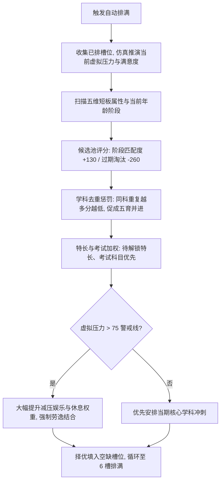

# 05. 日程安排与排满算法设计 (Schedule Planning & Heuristic Auto-Fill)

> 对应原设计文档：第5章 日程安排 (回合核心决策)

---

## 一、 系统定位与六槽位设计

日程安排是《中国式家长》每一回合中**最核心、最频繁的博弈决策点**。
玩家拥有 **6 个固定日程槽位（Slots）**，代表本回合孩子在学习、娱乐、社交、打工、休息之间的精力分配。

```
┌────────────────────────────────────────────────────────┐
│                      📅 本回合日程安排                  │
│                                                        │
│  [1. 语文·名著]  [2. 数学·函数]  [3. 英语·语法]         │
│  [4. 物理·入门]  [5. 校园KTV ]  [6. 睡大觉   ]         │
│                                                        │
│  📊 预测结算: 压力 48/100 (适中) | 父母满意度 92 (欣慰) │
│                                                        │
│      [ ⚡ 智能自动排满 ]       [ 🗑️ 一键清空槽位 ]      │
└────────────────────────────────────────────────────────┘
```

---

### 2.1 五大行为模型概要

| 行为类别 | 典型示例 | 消耗代价 | 核心收益与回报 | 策略博弈点 |
|:---|:---|:---|:---|:---|
| **学习类 (Learn)** | 翻身、拼音、四则运算、函数、高考冲刺、编程 | 累积压力 ($+2 \sim 5$)、少量消耗行动力 | **五维属性大幅增长、提升学科掌握度、提升父母满意度**、概率领悟特长 | 全排学习会导致下回合行动力见底、压力爆表产生心理阴影 |
| **娱乐类 (Play)** | 摆弄玩具、看动画片、校园KTV、追星、游戏机 | 消耗零用钱、降低父母满意度 ($-1 \sim -4$) | **大幅释放压力 ($-3 \sim -15$)**、微量提升想象/情商、概率解锁稀有才艺特长 | 全排娱乐会导致父母满意度崩盘挨训，学科成绩滑坡 |
| **打工类 (PayJob)** | 发传单、家教兼职、快餐店店员、夜市摆摊 | 消耗行动力 ($15 \sim 35$)、增加微量压力 | **赚取大量零花钱 ($+30 \sim 150$ 元)** | 初中起解锁，是用体力换金钱充实小卖部消费的利器 |
| **休息类 (Rest)** | 睡大觉、发呆、晒太阳 | 无（无需掌握前置） | **大幅消除压力 ($-10$)、回复行动力** | 在没有足够零钱进行高级娱乐时的应急防崩保底手段 |
| **索取类 (Beg)** | 索取电子琴、索取掌机、索取山地车 | 消耗宝贵索取次数、需要面子达标 | **获得强力永久娱乐道具或高级特长前置** | 需保持父母满意度 $\ge 80$ 才能获赠索取次数 |

---

### 2.2 全量 19 项课外娱乐活动明细表 (`D.plays`)

| 娱乐项目标识 | 活动名称 | 开放阶段 | 压力缓解 | 满意度影响 | 消费门槛 | 附加心智成长 | 关联文化记忆 |
|:---:|:---|:---:|:---:|:---:|:---:|:---|:---|
| `pl-che` | **玩具小车** | 婴儿期 | **$-2$** | $-1$ | 免费 | 想象 $+1$ | 地板上呼啸而过的发条小铁皮车 |
| `pl-maimai` | **躲猫猫** | 婴儿期 | **$-2$** | $-1$ | 免费 | 体魄 $+1$ | 蒙上眼睛就以为世界看不见自己 |
| `pl-cartoon` | **动画片** | 幼儿园 | **$-3$** | $-2$ | 免费 | 想象 $+1$ | 傍晚大风车与黑猫警长放映时光 |
| `pl-huat` | **大滑梯** | 幼儿园 | **$-2$** | $-1$ | 免费 | 体魄 $+1$ | 小区滑梯上的追逐欢笑 |
| `pl-paopao` | **吹泡泡** | 幼儿园 | **$-2$** | $-1$ | 免费 | 想象 $+1$ | 五彩斑斓的肥皂泡泡飞向天空 |
| `pl-lego` | **乐高积木** | 小学期 | **$-2$** | $-1$ | 免费 | 智商 $+1$，想象 $+1$ | 拼装属于自己的摩天大楼与战舰 |
| `pl-janghu` | **武侠小说** | 小学期 | **$-2$** | $-1$ | 免费 | 想象 $+1$，记忆 $+1$ | 课桌下偷看的江湖快意恩仇 |
| `pl-games` | **小霸王学习机** | 小学期 | **$-3$** | $-2$ | 免费 | 智商 $+1$，想象 $+1$ | “其乐无穷”的魂斗罗与超级马里奥 |
| `pl-zx` | **追星与演唱会** | 初中期 | **$-3$** | $-2$ | 免费 | 魅力 $+2$，情商 $+1$ | 磁带海报与随身听里的青涩偶像 |
| `pl-oju` | **黄金档偶像剧** | 初中期 | **$-3$** | $-2$ | 免费 | 情商 $+1$，魅力 $+1$ | 晚饭后偷瞄热播爱情偶像剧 |
| `pl-wang` | **网吧五连躺** | 初中期 | **$-4$** | $-3$ | 免费 | - | 放学偷偷溜进黑网吧开黑联机 |
| `pl-lanq` | **球场单挑** | 初中期 | **$-3$** | $-1$ | 免费 | 体魄 $+2$ | 水泥篮球场上的夕阳汗水 |
| `pl-sleep` | **睡大觉** | 初中期 | **$-5$** | $-2$ | 免费 | - | 周末拉紧窗帘睡到自然醒的奢侈 |
| `pl-library` | **泡图书馆** | 高中期 | **$-2$** | $0$ | 免费 | 记忆 $+2$ | 吹空调看闲书的避风港湾 |
| `pl-shetuan` | **学生社团活动** | 高中期 | **$-2$** | $-1$ | 免费 | 魅力 $+2$ | 校园广播站与文学社的活跃身影 |
| `pl-ktv` | **KTV麦霸狂欢** | 高中期 | **$-4$** | $-2$ | 15 元 | 魅力 $+1$，情商 $+1$ | 考后全班包厢嘶吼流行金曲 |
| `pl-bing` | **网吧包夜通宵** | 高中期 | **$-2$** | $-2$ | 20 元 | - | 泡面加卤蛋的青春放纵之夜 |
| `pl-college` | **社团出摊摆点** | 大学期 | **$-2$** | $-1$ | 免费 | 魅力 $+1$，情商 $+1$ | 百团大战林荫道上的热血招新 |
| `pl-pao` | **操场夜跑撸铁** | 大学期 | **$-2$** | $0$ | 免费 | 体魄 $+2$ | 戴降噪耳机的夜色独处自律时光 |

---

## 三、 对齐原版机制：研习解锁与无限次复选

在早期设计中，部分技能容易被误做成单次消耗。本版本完全对齐原作核心规则：
1. **悟性研习是一次性投资**：消耗悟性将新技能由“未知”转变为“已掌握（Learned）”。
2. **已掌握课程可在 6 个槽位中无限次重复排入**：例如，为了备战奥数竞赛，玩家可以在当回合 6 个槽位全部排入“数学·代与函数”，以此快速拉高智商与数学单科掌握度。
3. **槽位自由撤销（Undo-Safe）**：从槽位中移除已排入的课程仅释放当前槽位，绝不退还也不扣除悟性，更不会破坏已掌握技能列表。

---

## 四、 智能自动排满算法详解 (Heuristic Auto-Fill Engine)

为了让玩家在长达 58 回合的养成过程中减少繁琐的重复点击，系统内置了一套符合教育养成规律的**启发式自动排满引擎 (`autoFillSlots`)**。
该算法彻底杜绝了“小学初中依然排翻身”和“充沛体力依然全排睡大觉”的缺陷：



### 4.1 核心算法数学模型
对候选行为 $k$ 的动态评估得分函数：
$$\text{Score}(k) = \text{BaseScore} + \text{PhaseMatch}(k) + \text{DiversityBonus}(k) + \text{ShortboardBonus}(k) + \text{StressControl}(k)$$

1. **阶段匹配度 ($\text{PhaseMatch}$)**：
   - 当期年级课程：$+130$ 分；
   - 上一年级过渡课程：$+35$ 分；
   - 跨两个阶段前课程：$-80$ 分；
   - 彻底过期的婴儿/远古动作（如初中排翻身）：$-260$ 分（直接淘汰）。
2. **学科去重与全面发展 ($\text{DiversityBonus}$)**：
   - 该课程在当回合已被选入 1 次：$-30$ 分；
   - 已被选入 2 次：$-75$ 分；
   - 已被选入 3 次及以上：$-140$ 分（鼓励语数外物化生均衡涉猎）。
3. **动态劳逸结合与防崩溃机制 ($\text{StressControl}$)**：
   - 若虚拟推演压力 $\text{SimStress} \ge 75$：娱乐项目权重大幅飙升 $+90$ 分，若缺少娱乐则自动补充睡大觉（最多补充 1~2 格，严禁 6 格全睡）。
   - 若虚拟推演压力 $\le 30$：娱乐与休息权重自动削减 $-60$ 分，集中精力推进学业。
