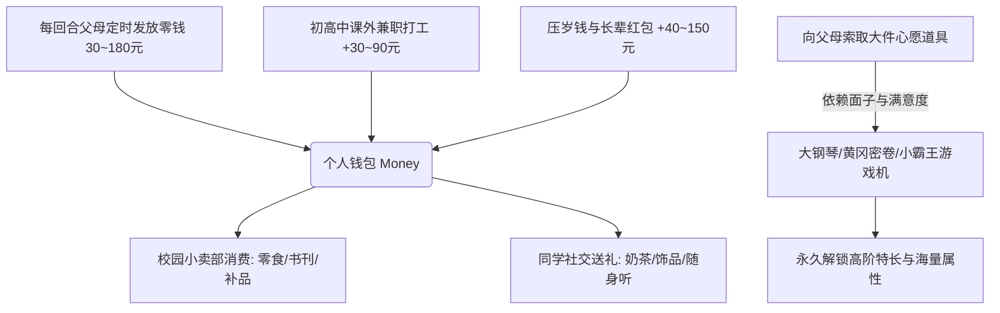

# 09. 经济系统、校园小卖部与索取机制 (Economy, Store & Begging)

> 对应原设计文档：第9章（原） 经济系统

---

## 一、 经济系统运行框架

经济系统构成了玩家在学习之外的**物资后勤与心理减压生命线**。
从小学阶段起（Turn 15），零花钱系统与校园小卖部同步开放，玩家开始拥有自主支配资金的权力。

---

## 二、 零花钱供给机制 (Allowances & Part-Time Jobs)

### 2.1 父母零花钱发放
- **解锁时机**：从小学一年级（Turn 15）正式开始按期发放；
- **发放周期**：每回合启幕时自动存入钱包；
- **门第阶层挂钩**：
  $$\text{BaseMoney} = 30 + \text{Tier} \times 25 + \text{Random}(0, 10)$$
  寒门开局每回合仅约 30 元，而世家名门后代每回合坐享 150~180 元丰厚零花，天然具备购买高阶辅导书与艺术品的经济优势。

### 2.2 课外兼职打工清单 (初中起解锁)
初中起（Turn 25），孩子个头蹿高，开始具备用空余行动力打工赚钱的自立能力：

| 兼职标识 | 兼职工作名称 | 开放阶段 | 行动力消耗 | 报酬收益 | 代价与额外属性 | 现实文化映射 |
|:---:|:---|:---:|:---:|:---:|:---|:---|
| `pj-fly` | **校门口发传单** | 初中起 | 20 点 | **$+30$ 元** | 压力 $+2$，体魄 $+1$ | 风吹日晒的勤工俭学初体验 |
| `pj-tutor` | **给低年级辅导作业** | 初中起 | 25 点 | **$+45$ 元** | 压力 $+2$，智商 $+1$，情商 $+1$ | 知识变现，当小老师锻炼沟通 |
| `pj-net` | **黑网吧夜班兼职** | 初中起 | 20 点 | **$+35$ 元** | 压力 $-1$（免费蹭网玩游戏） | 属于千禧年初的时代灰色记忆 |
| `pj-int` | **知名企业业务实习** | 大学期 | 35 点 | **$+90$ 元** | 压力 $+3$，情商 $+2$ | 体验真实职场螺丝钉生活 |

---

## 三、 校园小卖部商品全景清单 (Campus Store)

校园小卖部是消耗零花钱即刻变现为五维属性、悟性与减压的宝地。部分商品拥有极高战略价值：

| 道具名称 | 图标 | 零售单价 | 即时购买效果 | 战术定位与核心价值 |
|:---|:---:|:---:|:---|:---|
| **五彩棒棒糖** | 🍭 | 5 元 | 压力 $-2$ 点 | 极低成本微量平复心情的小零食 |
| **香辣卫龙辣条** | 🌶️ | 8 元 | 压力 $-3$ 点，体魄 $-1$ 点 | 解馋爽快，但多吃容易拉肚子 |
| **冰镇西瓜冰棍** | 🍉 | 10 元 | 压力 $-4$ 点 | 夏日课后放学路上的绝妙享受 |
| **课外世界名著** | 📖 | 30 元 | **悟性 $+15$ 点** | 扩大知识面，额外补充悟性 |
| **48色水溶彩笔** | 🖍️ | 25 元 | 想象力 $+6$ 点 | 艺术类考生的前置提分工具 |
| **高能运动饮料** | 🧃 | 15 元 | **行动力 $+15$ 点** | 当回合突破行动力上限的续航神器 |
| **深海鱼油补脑品** | 🧠 | 60 元 | **悟性 $+60$ 点** | 备战中考与选秀时的关键悟性大补丸 |
| **名师辅导班代金券** | 🎟️ | 80 元 | **悟性 $+100$ 点** | 高性价比悟性包，快速点亮主干课程 |
| **自动彩虹卷笔刀** | 🖊️ | 20 元 | 想象力 $+3$，情商 $+2$ | 班级桌上炫耀的文具宠儿 |
| **深呼吸强效打气筒** | 💊 | 40 元 | **压力 $-20$ 点**，情商 $+3$ | **高压防崩核心神药**，一键拉回安全线 |
| **限量版毛绒玩偶** | 🧸 | 35 元 | 情商 $+5$ 点 | 送给女同学可大幅拉升好感度 |
| **重点中学跑步鞋** | 👟 | 80 元 | 体魄 $+8$ 点 | 体育中考冲满分的坚实物理外挂 |
| **三年高考五年模拟** | 📙 | 70 元 | **高考考分加成 $+40$ 分** | **高考提分神器**，直接折算为最终总成绩 |

---

## 四、 向父母“索取”系统 (The Begging Mechanics)

### 4.1 机制运行规则（对齐原作）
“索取”是向父母提出购买那些价格昂贵、能够根本性改变成长轨迹的大件物资（大钢琴、游戏机、密卷）。
1. **索取资格获取**：每当回合结算时，若**父母满意度 $\ge 80$ 点**（欣慰状态），系统将赠予 1 次索取次数；
2. **面子门槛限制**：每个心愿道具均有固定的家庭面子要求（$30 \sim 150$ 点不等）。若家庭面子不足，父母直接拒绝甚至训斥；
3. **成功率动态判定**：
   $$\text{SuccessRate} = \text{Clamp}(\text{BaseRate}(w) + \text{SatBonus} + \text{TierBonus}, \ 0.25, \ 0.85)$$
   - 若索取成功：该道具永久入库，解锁专属高阶日程动作（如弹大钢琴），带来巨额属性与专属史诗/传说特长；
   - 若索取失败：扣除 1 次索取次数，父母满意度微降，需等待下次机会。

### 4.2 索取心愿道具名录

| 心愿道具 | 图标 | 面子门槛 | 满意度需求 | 基础成功率 | 成功所获永续加成 | 现实文化与剧情暗线 |
|:---|:---:|:---:|:---:|:---:|:---|:---|
| **儿童电子琴** | 🎹 | 30 点 | 20 点 | 65% | 想象 $+5$，情商 $+3$，解锁【电子琴】 | 以高雅情操为由，迈向音乐家第一步 |
| **小霸王游戏机** | 🎮 | 60 点 | 35 点 | 55% | 智商 $+4$，想象 $+4$，压力 $-15$ | “妈，这真是买来学打字和编程的！” |
| **全套漫画大全** | 📚 | 25 点 | 15 点 | 70% | 想象 $+6$，压力 $-20$ | 课外减压圣品，课间偷偷传阅 |
| **名牌气垫跑鞋** | 👟 | 80 点 | 30 点 | 50% | 体魄 $+8$，魅力 $+4$ | 穿上全校瞩目，体育立定跳远破纪录 |
| **真木立式大钢琴** | 🎼 | 150 点 | 55 点 | 35% | 魅力 $+12$，想象 $+10$，满意 $+15$ | **全家战略级大投资**，亲友串门压轴大杀器 |
| **黄冈密卷强化版** | 📗 | 90 点 | 40 点 | 65% | 智商 $+8$，记忆 $+8$，**考分 $+35$** | 孩子主动要试卷做，家长热泪盈眶欣然准奏 |
