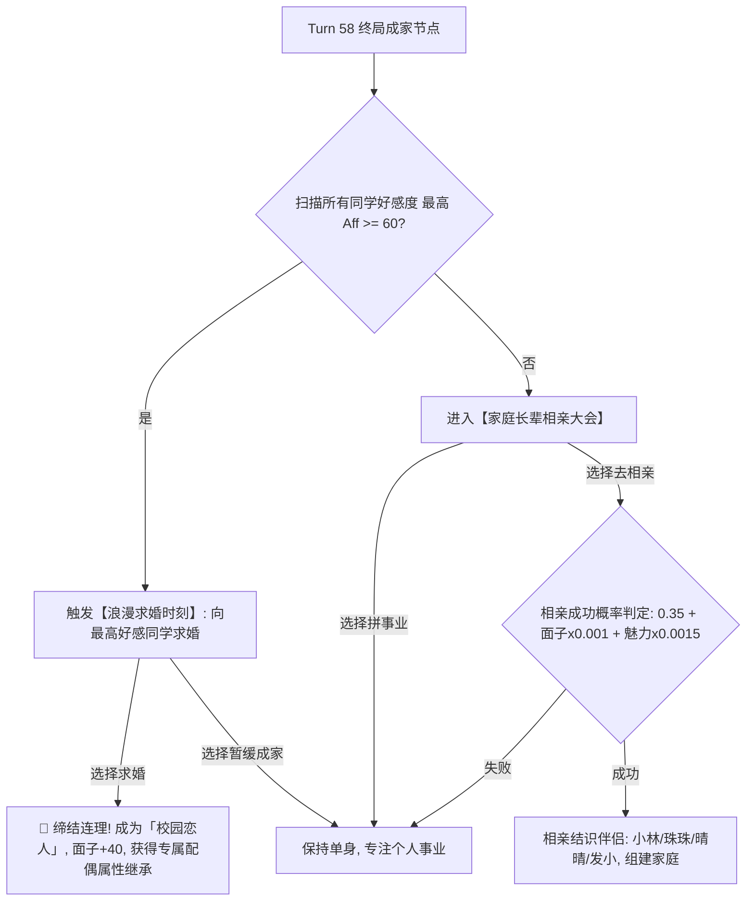

# 11. 同学社交、好感度与婚恋相亲系统 (Social, Romance & Marriage)

> 对应原设计文档：第11章（原） 社交与恋爱

---

## 一、 系统定位与青春叙事

初中阶段起（Turn 25），孩子步入青春发育期，**【同学往来】社交圈解禁**。
社交系统重现了青葱岁月里那份小心翼翼的同窗情谊：上课传小纸条、放学一起推单车、送给心仪同桌一块水果硬糖、乃至经历从青涩校服走到圣洁婚纱的罗曼蒂克史诗。

```
┌────────────────────────────────────────────────────────┐
│                   👥 同学往来社交圈                     │
│                                                        │
│  [🌸 苏软软]  好感度: ❤️❤️❤️🤍🤍 (65/100)               │
│  人设: 坐在后排安静的邻座女孩，抽屉里贴满了可爱贴纸     │
│                                                        │
│   [ 💬 课间闲聊 (消耗15行动) ]   [ 🎁 赠送小熊玩偶 ]   │
│                                                        │
│  苏软软：“呀，你怎么知道我一直想要这个小熊！谢谢你~”    │
│  好感度大幅提升！当前好感: 85 (深厚羁绊)                │
└────────────────────────────────────────────────────────┘
```

---

## 二、 7 位个性化同学 NPC 人设档案 (NPC Characters)

系统内置了 7 位性格、家境与偏好各异的同学，涵盖男女主角在不同阶段的社交选择：

| 同学标识 | 姓名与图标 | 性别 | 登场阶段 | 人设性格画像 | 偏好礼物清单 (`like`) | 伴侣代际遗传优势 |
|:---:|:---:|:---:|:---:|:---|:---|:---|
| `summer` | **苏软软** 🌸 | 女 | 幼儿园起 | 后排文静内向女孩，爱画画手账，心思极度细腻 | 妮妮饼干、荧光笔、毛绒玩偶 | **情商 $+20$，想象 $+25$** |
| `shenhan` | **沈寒** ❄️ | 男 | 初中期 | 校篮球队后卫，高冷寡言，但在关键时刻极具担当 | 游戏卡、篮球、运动饮料 | **体魄 $+30$，情商 $+15$** |
| `xiaomei` | **夏小美** 🍡 | 女 | 小学期 | 活泼开朗开心果，笑声极其治愈，全班的氛围担当 | 漫画书、小熊玩偶、辣条 | **情商 $+25$，魅力 $+20$** |
| `lizhen` | **李振** 🔥 | 男 | 初中期 | 阳光开朗体育委员，运动会上屡创校纪录的热血少年 | 重点跑鞋、小霸王游戏机 | **体魄 $+35$，意志 $+15$** |
| `yuanyuan`| **媛媛** 🧸 | 女 | 初中期 | 精致爱美的前桌女孩，热爱时尚穿搭与流行音乐 | 奶茶券、精致饰品、彩色卷笔刀 | **魅力 $+35$，情商 $+20$** |
| `kongde` | **孔德** 🤠 | 男 | 高中期 | 校天文社社长，理科极强，偶尔有点可爱中二 | 单筒望远镜、科幻漫画、三年模拟 | **智商 $+35$，记忆 $+20$** |
| `qixue` | **棋子** 🎮 | 女 | 高中期 | 电竞与算法奇才少女，操场联机开黑的不败王者 | 游戏充值卡、任天堂卡带 | **智商 $+30$，想象 $+25$** |

---

## 三、 社交互动形式与好感度阶梯

### 3.1 课间闲聊 (Chat)
- **消耗**：消耗 15 点行动力；
- **机制**：基于双方情商比对与随机性格投缘判定，好感度增长 $+3 \sim 8$ 点；
- **冷却机制**：同一同学单回合最多连续聊天 2 次，避免过度刷好感。

### 3.2 投其所好赠送礼物 (Gift)
- **送对偏好礼物**：好感度暴涨 $+15 \sim 25$ 点，回赠一句专属甜蜜/热血台词；
- **赠送普通礼物**：好感度微增 $+5$ 点；
- **赠送厌恶礼物**：对方礼貌婉拒，可能浪费金钱。

### 3.3 早恋风险与家长谈心
- 若在初高中阶段好感度突破 80，可能触发【班主任约谈】或【老妈翻抽屉发现日记】特殊随机事件。妥善应对可保全面子与心理状态，处理不当会面临父母满意度惩罚。

---

## 四、 终局婚姻判定：从校服到婚纱 vs 家庭相亲局

在人生的终章（Turn 58），角色迎来人生的婚恋大事，系统严格分为两条发展线：



### 4.1 校园恋人浪漫求婚
若与某位同学好感度 $\ge 60$（最佳 $\ge 80$）：
- 屏幕弹出深情求婚立绘弹窗：“从青涩学生时代一路相伴至今，此时此刻你想对TA说……”
- 求婚成功：直接喜结良缘，家庭面子大涨 $+40$ 点，**伴侣将以【校园恋人】专属身份载入家族史册，其优异属性将全额注入下一代遗传基因**！

### 4.2 长辈相亲局 (Blind Date)
若青春期专注做题未曾恋爱，三十而立后被长辈推入相亲市场：
- **相亲成功率公式**：
  $$\text{MarryProb} = \min\left(0.9, \ 0.35 + \text{Face} \times 0.001 + \text{Cha} \times 0.0015\right)$$
  *家庭面子越高、个人魅力越出众，在相亲角越是抢手的“香饽饽”！*
- 成功可结识相亲贤内助（如【同事介绍的小林】、【咖啡馆里投缘的晴晴】等），为下一代注入稳定的家庭扶持。
