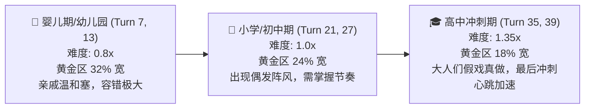

# 22. 过年收红包玩法设计文档 (Hongbao Duel Minigame)

> 对应原版《中国式家长》：春节红包推拉小游戏 (Tug-of-War QTE)  
> 文档版本：v2.5.0  
> 状态：设计就绪 (Design Ready)

---

## 一、 系统定位与现实文化映射

在传统中国家庭春节走亲访友中，“收红包”是一场充满戏剧张力与人情世故的高难度心理博弈：
- **亲戚的硬塞攻势**：“小宝又长高了！这是长辈给的压岁钱，拿着！”（双手死命往孩子羽绒服口袋里塞）；
- **母亲的疯狂阻拦**：“哎呀使不得使不得！他个小孩子身上带什么钱！快收回去！”（身体横挡、推手拦截）；
- **孩子的微操困境**：心里极度渴望（买玩具/买辣条），但绝不能直接伸手抓（会被骂贪心、不懂规矩），也不能推辞过头（亲戚真顺坡下驴把钱收回去了，欲哭无泪）。

本系统深度复刻《中国式家长》原版红包玩法精髓，将中国式人情拉扯转化为**带物理阻尼的游标动态平衡与节奏对抗小游戏**。

---

## 二、 玩法规则与核心力学模型

### 2.1 游标刻度与判定区间
刻度轨全长为 $0\% \sim 100\%$，包含四大动态区间：

```
[ 0% ----------- 35% ------------ 65% ------------ 80% ---------- 100% ]
  ✋ 客套拒收区      |   🌟 黄金得体区  |     过渡客套     |   🤲 猴急直接夺
  (推辞过猛,得0元)    | (拿满红包+面子+20) | (拿普通红包+面子+5) | (拿普通红包,面子-25)
```

1. **🌟 黄金得体区（Sweet Spot）**：
   - 处于中位区间（基准 $38\% \sim 68\%$，随亲戚和阶段动态收缩/平移）；
   - **终局奖励**：获得全额压岁钱（$180 \sim 360$ 元），家庭面子 $+20$，心情 $+6$；
   - **评价**：“🎉 进退得体，堪称红包推拉大师！长辈欣慰塞下红包，父母在旁倍感有面！”
2. **✋ 推脱过猛区（Over-Refusal，$< 35\%$）**：
   - 游标偏向左端，客套戏演过了头；
   - **终局结果**：获得 $0$ 元（亲戚叹气收回：“这孩子太老实了”），家庭面子微增 $+10$（虽败犹荣的虚伪）。
3. **🤲 猴急直接夺区（Greedy Grab，$> 80\%$）**：
   - 游标偏向右端，未等大人推辞完就强行收进口袋；
   - **终局结果**：拿到基础红包（$120 \sim 180$ 元），但老妈当场给白眼，家庭面子 $-25$，心情 $-8$。
4. **过渡客套区（Neutral Acceptance）**：
   - 落在黄金区边缘（如 $35\% \sim 38\%$ 或 $68\% \sim 80\%$）；
   - **终局结果**：拿到基础红包，家庭面子 $+5$。

---

## 三、 亲戚性格矩阵与力学 Profile

不同亲戚的长辈性格截然不同，在游戏中对应独特的物理动力学参数：

| 亲戚角色 | 现实特质描述 | 基准漂移力 ($F_{\text{drift}}$) | 黄金区宽度与位置 | 专属随机阵风 ($F_{\text{gust}}$) | 压岁钱厚度 |
| :--- | :--- | :--- | :--- | :--- | :--- |
| **热情大姑妈** | 猛塞型，力大砖飞，必须塞进兜 | 持续向右 $+1.8$（猛塞进兜） | 居中 $45\% \sim 69\%$（宽 24%） | 触发率 35%：“拿着买肉吃！”向右突击冲刺 | $200 \sim 300$ 元 |
| **精明客套二叔** | 表面客套，暗中想收回省点钱 | 持续向左 $-1.5$（往回收缩） | 偏右 $50\% \sim 78\%$（宽 28%） | 触发率 40%：“二叔收回去了啊”快速滑落 | $150 \sim 220$ 元 |
| **雷厉风行表舅** | 豪爽海派，雷厉风行，讲求排面 | 强正弦波振荡 $\sin(\omega t)$ | 居中 $40\% \sim 60\%$（宽 20%） | 倒计时最后 1.5 秒必发大暴击推进 | $260 \sim 360$ 元 |
| **内敛严肃王阿姨**| 书香门第，极重规矩与分寸 | 漂移平缓，但容错极低 | 居中 $45\% \sim 61\%$（超窄 16%） | 高频微抖动，严苛考验微调能力 | $180 \sim 250$ 元 |

---

## 四、 年龄阶段难度成长体系

随着主角成长，过年面对亲戚的拉扯难度逐级提升：



1. **初始游标脱位生成**：
   - 彻底摒弃“开局直接落在 52% 黄金区”的静态设计；
   - 根据亲戚主漂移方向，游标初始随机出生在 **外缘边缘区**（如 $18\% \sim 28\%$ 或 $72\% \sim 82\%$）；
   - 玩家必须在倒计时开始的第一秒内迅速做出反应，通过轻点将游标调整回黄金区。
2. **拔河来回跳动与倒计时曲线**：
   - 全局倒计时加长至 **8.0 秒**（支持玩家完整体验 $3 \sim 4$ 轮亲戚与母亲的攻防拉扯回合）；
   - 前 $5.8$ 秒为双频振荡拉扯博弈期，红包在拒收区、黄金区与急切区之间来回跳动，并受边缘强弹力拦截；
   - 最后 $2.2$ 秒进入“决胜拉扯冲刺”，进度条变红并加速跳动，解锁“见好就收”压轴定局按钮，决定最终成败！

---

## 五、 操作手感与多端适配

1. **PC 端交互**：
   - 支持鼠标点击双向推拉按钮；
   - 支持键盘快捷键：
     - **空格键 (Space)** 或 **右方向键 (→)**：施加向右推力（“其实我想要/假推实收”）；
     - **左方向键 (←)**：施加向左推力（“使不得使不得/客套推辞”）。
2. **移动端触控**：
   - 底部采用左右分屏大按钮设计，大拇指单手或双指轻按即可连续对抗。
3. **人性化保底跳过**：
   - 保留右下角小字“⏩ 跳过”，满足只想推进主线剧情的休闲玩家需求（跳过以普通中间区间保底结算，不扣面子）。
