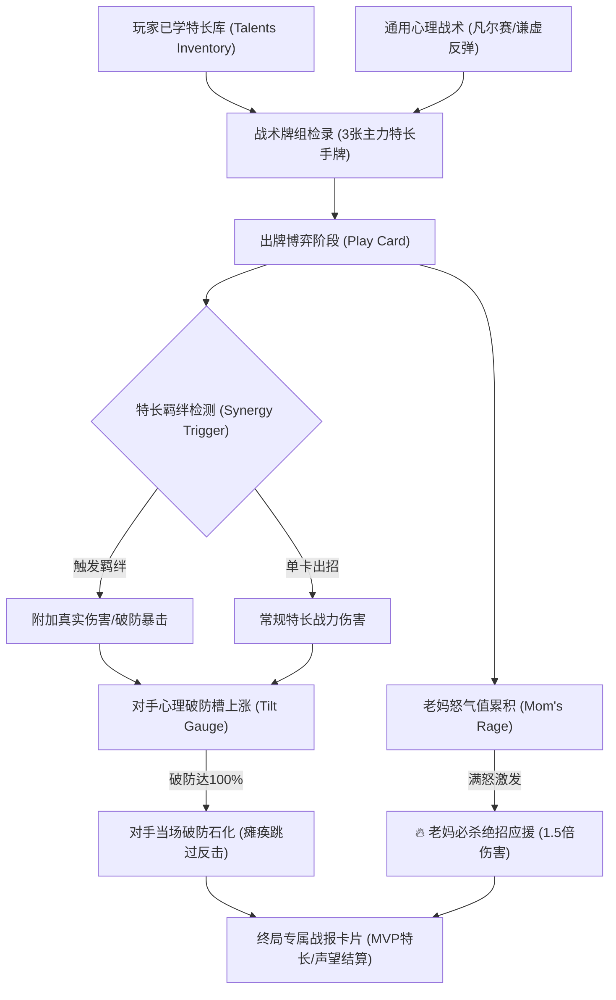

# 24. 面子对决 2.0 玩法与数值深度重塑文档 (Face Duel 2.0 Design)

> **对应版本**：v2.5.0+  
> **设计目标**：将面子对决从单调的“单特长固定对轰”升级为“特长组合手牌化、羁绊连锁加成、对手心理破防槽、老妈必杀应援”的多维博弈卡牌舞台。

---

## 一、 系统定位与中国式人情世故隐喻

### 1.1 文化背景
“面子对决”是中国式家庭社交中最具代表性、最微妙的修罗场：
- **过年走亲戚 / 家族聚餐 / 邻里偶遇**：大人们表面上客客气气，暗地里却通过炫耀孩子的特长、成绩、荣誉展开白热化的凡尔赛攀比。
- **孩子的战术处境**：既不能露怯给父母丢面子，也不能瞎吹牛被当场拆穿，必须合理调用平时所学的看家本领，结合心理战术将对方的“凡尔赛攻势”全盘化解甚至反戈一击！

---

## 二、 核心机制革新矩阵 (Face Duel 2.0 Core Pillars)

### 2.1 特长手牌卡组构筑 (Hand Construction)
摒弃旧版“永远只取单张最佳特长”的机械逻辑：
1. **多特长出战检录**：系统从玩家当前已觉醒特长中，按战力自动精选 **前 3 张顶尖特长卡**（若特长不足则由基础技能补齐）；
2. **两张常驻心理战术卡**：
   - 【凡尔赛冷嘲】（基于 IQ/EQ 的真实心理破防）；
   - 【谦虚客套防反】（大幅减伤 65%，回复自身气势 35 点，累积老妈怒气）；
3. **实时动态出招选择**：每轮交锋，玩家从 $3 \sim 4$ 张手牌中根据对手当前的招式与情绪择机出牌！

---

## 三、 四大特长羁绊连锁体系 (Talent Synergies)

当玩家掌握的特长卡牌形成特定组合时，出牌将激活高光羁绊特效：

| 羁绊代号 | 羁绊名称 | 激活条件 (特长类别与标签) | 战斗增益效果 | 戏剧台词彩蛋 |
|:---|:---|:---|:---|:---|
| **`SYNERGY_STEM`** | **理科降维打击** | 同时掌握 2 项学科/数理特长 (如: 压轴题杀手、心算神童、奥数金牌) | 造成 **$+35\%$ 伤害**，且 **直接贯穿对手防御** | “这道压轴题全省只有三个人解出来，不才正是在下！” |
| **`SYNERGY_ART`** | **文质彬彬/艺冠全场** | 同时掌握 2 项艺术/文史特长 (如: 钢琴十级、书法金奖、小作文大师) | 造成 **$+30\%$ 伤害**，并为己方 **回复 25 点气势** | “落霞与孤鹜齐飞，秋水共长天一色。长辈见笑了。” |
| **`SYNERGY_STAGE`** | **舞台霸者/声势夺人** | 同时掌握声乐、街舞、演讲或大嗓门 | 额外使对手 **心理破防槽激增 $+30\%$** | “全场的目光随我的节拍律动，掌声根本停不下来！” |
| **`SYNERGY_WITTY`** | **人间清醒/爆笑破功** | 掌握脑筋急转弯、相声、段子手等趣味特长 | 使对手下轮 **攻击力骤降 $-45\%$** | “您家孩子这么厉害，怎么没考上清华少儿预科班呢？” |

---

## 四、 对手情绪破防系统 (Opponent Demeanor & Tilt)

对手不再是无知觉的木桩，拥有动态 $0\% \sim 100\%$ 的【心理破防槽（Tilt Gauge）】：

1. **破防槽积攒规则**：
   - 受到特长直接暴击时：增加与伤害等比的破防值（$\text{Dmg} \times 0.25$）；
   - 玩家使用【谦虚反弹】成功化解攻势时：对方扑空产生挫败感，破防值 $+20\%$；
   - 触发特长羁绊时：破防值额外暴增 $+25\%$；
2. **三阶情绪状态**：
   - **0% ~ 40%【趾高气昂】**：神气活现，出招带有傲慢暴击加成；
   - **41% ~ 80%【神色慌乱】**：额头冒汗，台词变得急促，伤害产生波动；
   - **81% ~ 99%【气急败坏】**：开始胡乱攀比，容易露出破绽；
   - **100%【当场破防/语无伦次】**：对手大脑当机！**直接瘫痪跳过本轮反击**，同时玩家下一轮对其造成的伤害提升 $30\%$！

---

## 五、 老妈场外应援与必杀大招 (Mom's Rage Climax)

在面子对决中，老妈站在身后是全场最坚实的后盾：

1. **老妈怒气槽（Mom's Rage）**：
   - 当我方面子受到对手重创时，老妈怒气 $+30\%$；
   - 连续交锋到第 3 回合未分胜负时，老妈护崽心切，怒气自动蓄满；
2. **老妈必杀技【拍案而起 · 全家杀手锏】**：
   - 怒气蓄满时界面点亮高光大招按钮；
   - **效果**：老妈亲自下场助威：“我家宝儿昨天刚被市长接见表彰！”；
   - 造成 **$1.5 \times$ 爆发伤害**，附带屏幕金光震颤与清脆打击音效，彻底击溃对手心理防线！

---

## 六、 胜负与沉浸式战报公报 (Battle Report)

战斗结束后，绝不立刻闪退弹窗，而是切换为**专属面子对决终局战报卡片**：
- **终局徽章**：
  - 🏆 **全场称赞 · 扬眉吐气**（敌方面子归零或剩余面子领先）：家庭面子 $+120$，心情 $+10$；
  - 🌧️ **甘拜下风 · 默默低头**（我方面子归零）：家庭面子 $-40$；
- **战果亮点**：
  - 呈现本场 **MVP 特长**（输出最高特长卡）；
  - 呈现触发的 **特长羁绊** 与 **老妈大招评价**；
  - 记录双方交锋终局残余面子数值；
- **亲戚离场喜剧对白**：
  - 对手惨败：“哎呀炉子上还炖着母鸡汤，失陪失陪……”（悻悻离席）；
  - 确认按钮：“带着荣誉凯旋而归 👏”，点击后刷新主界面属性与日程。
