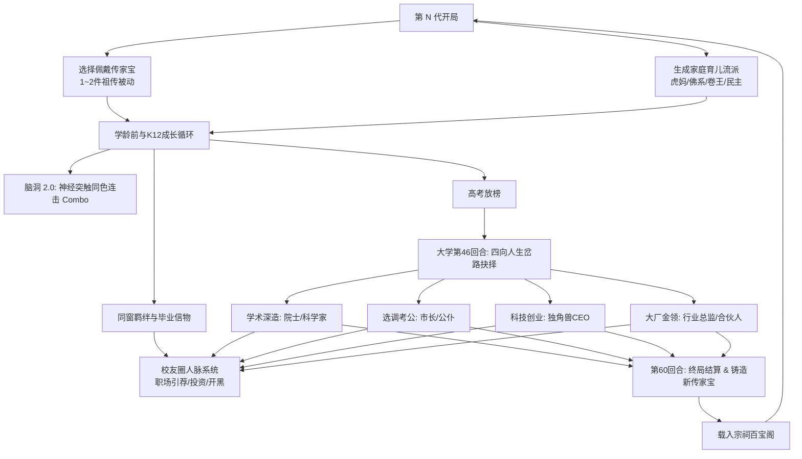
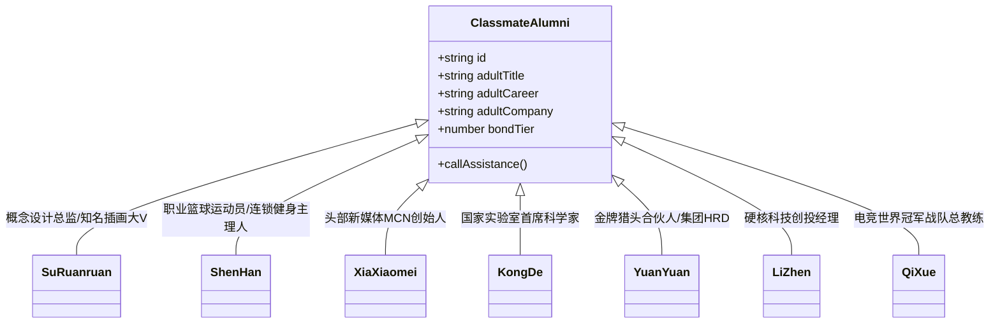
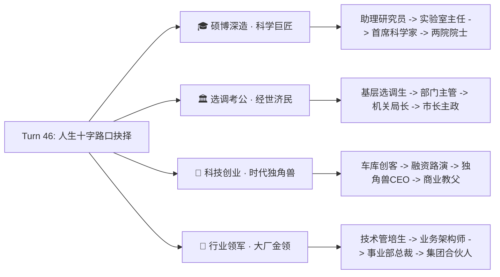

# 30. 《中国式家长》v2.7 核心玩法系统深度扩展设计规范 (Game Design Document)

> 文档版本: v2.7.0-GDD  
> 责任角色: 玩法设计师 (Game Designer)  
> 适用工程: `chinese-parent` H5 纯前端单页架构  
> 更新日期: 2026-10-08  

---

## 目录
1. [设计愿景与整体架构](#一设计愿景与整体架构)
2. [模块一：家庭育儿流派系统 (Parenting Style Archetypes)](#二模块一家庭育儿流派系统-parenting-style-archetypes)
3. [模块二：传家宝与祖宅百宝阁系统 (Ancestral Relics & Heirlooms)](#三模块二传家宝与祖宅百宝阁系统-ancestral-relics--heirlooms)
4. [模块三：同窗校友圈与成人期人脉网络 (Alumni Network & Social Dynamics)](#四模块三同窗校友圈与成人期人脉网络-alumni-network--social-dynamics)
5. [模块四：脑洞 2.0 神经突触连锁共鸣与阶段脑域 (Synaptic Combos & Domains)](#五模块四脑洞-20-神经突触连锁共鸣与阶段脑域-synaptic-combos--domains)
6. [模块五：大学四向深造分支与成人期人生岔路 (Higher Education & Divergent Paths)](#六模块五大学四向深造分支与成人期人生岔路-higher-education--divergent-paths)
7. [数值平衡与代际循环交互大图](#七数值平衡与代际循环交互大图)

---

## 一、 设计愿景与整体架构

《中国式家长》在经历了 v2.0 至 v2.6 的迭代后，已经构建了极具沉浸感的“日程-脑洞-社交-特长-选秀-面子对决-高考-相亲-世代族谱”九大骨架。但在长期可玩性上，仍然存在三大痛点：
1. **家庭氛围千篇一律**：每一代的父母除了提供零花钱和审批索取外，性格与育儿理念雷同，缺乏原生家庭的差异感；
2. **成年期与青春期断层**：高中毕业后同窗同学沦为单纯的相亲备选，大学与职场期日程选择偏向线性，缺少人生重大分流的策略张力；
3. **世代传承实体感不足**：族谱画卷记录了名字，但玩家感受不到先祖留下的“传家实体底蕴”。

v2.7 “一代山河 · 百年门第”版本，围绕**原生家庭、传家重宝、校友人脉、智力共鸣、多元人生**五大维度进行深度扩展，构建如下系统矩阵：

---

## 二、 模块一：家庭育儿流派系统 (Parenting Style Archetypes)

### 2.1 流派设定与特征矩阵
每一代出生时，父母将被赋予四大典型中国式育儿风格之一：

| 流派名称 | 核心理念 | 数值被动特效 | 索取偏好修正 | 专属日常与沟通 |
|:---|:---|:---|:---|:---|
| **📚 严父虎妈** `tiger` | “吃得苦中苦，方为人上人” | 学习类日程消耗行动点 **-1**（最低1点）；每次考试自动赋予 **+25% 冲刺 Buff**；每回合基础自然压力 **+5**； | 学习类索取成功率 **+35%**；娱乐类索取成功率 **直接归零 (0%)** | 深夜热牛奶与加练卷子；私自撕毁漫画书；全家群攀比排名 |
| **🍃 佛系散养** `buddhist` | “健康快乐就好，平平淡淡才是真” | 每回合压力自然下降 **-8**；心理阴影上限封顶于 **60**（杜绝崩溃）；体魄成长 **+20%**；每月零花钱 **-20%**； | 娱乐类索取成功率 **+30%**；无需高面子即可批准；学习大件索取偏低 | 母亲喊回家吃饭；放学去抓泥鳅；周末全家露营野餐； |
| **⭐ 卷王世家** `elite` | “我们家丢不起这个人！” | 开局面子 **+50**；开局零花钱 **+120**；选秀与面子对决伤害 **+25%**；若期末/选秀未拿前两名，满意度 **-25** | 索取门槛面子需求 **+25**；一旦满足门槛，成功率 **100% 批准** | 私教名师上门试听；高规格商业晚宴；家族聚会凡尔赛大招 |
| **🤝 民主知心** `democratic` | “做彼此最好的朋友与引路人” | 行动力上限 **+20**；情商与魅力成长 **+15%**；父母满意度自然保底不低于 **50**；行动力消耗平稳 | 索取成功率直接与父母满意度正比挂钩；失败时不增加阴影 | 围炉夜话倾听心声；父母向孩子请教新潮APP；尊重个性志愿 |

### 2.2 流派决定机制
- **第 1 代开局**：在四种流派中均等随机赋予；
- **第 2 代及后续世代（代际继承与反弹法则）**：
  - 若上一代取得【传奇/SSS】或职业门第 Tier 5：**60%** 概率成为【卷王世家】，**20%** 成为【严父虎妈】，**20%** 成为【民主知心】；
  - 若上一代终局压力 > 80 或心理阴影 > 50（高压童年反弹）：**55%** 概率转型为【佛系散养】（“我绝不能让我的孩子再受一遍这种苦”）；
  - 其余情况下在四种流派中加权随机（权重: 民主 30%, 虎妈 25%, 佛系 25%, 卷王 20%）。

---

## 三、 模块二：传家宝与祖宅百宝阁系统 (Ancestral Relics & Heirlooms)

### 3.1 传家宝定位与规则
传家宝是跨越无限世代、永久保存在家族宗祠（`cph_fam.heirlooms`）中的实体信物。
- **铸造契机**：每代第 60 回合终局结算时，若达到指定成就或职业/高考门槛，本代主角可将随身核心象征封存为一件传家宝；
- **佩戴规则**：下一代开局时，可从百宝阁中选择 **最多 2 件传家宝** 佩戴；
- **耐久与生效**：传家宝永不磨损，佩戴后全生命周期提供独特的 Passive 被动增益。

### 3.2 八大传家宝谱系表

| 传家宝 ID | 宝物名称 | 铸造达成条件 | 专属增益效果 (Passive) | 文化典故与故事 |
|:---|:---|:---|:---|:---|
| `relic_bike` | **🚲 先祖的二八大杠** | 第一代通关或体魄 > 150 | 行动力上限 **+30**，每回合基础行动力回复 **+10** | “链条擦得雪亮，曾经载着父亲穿过风雨无阻的求学路。” |
| `relic_paper` | **📜 黄冈状元手抄密卷** | 高考分 ≥ 18500 或清北录取 | 全学科课程掌握速度 **+25%**，期末考与中高考基础分 **+350** | “泛黄的草稿纸上，工整记录着一代学神攻克压轴题的心得。” |
| `relic_stock` | **📈 首富的原始股凭单** | 职业为首富/CEO或财富 > 1000 | 零花钱与职场工资 **+40%**，开局家族压岁钱额外 **+150 元** | “一家伟大民营企业的创世股权，每一张分红单都是家族底气。” |
| `relic_racket`| **🏓 妈妈的双喜乒乓拍** | 觉醒体育类特长 ≥ 2 项 | 体魄属性 **+35**，面子对决时防御反弹伤害 **+40%** | “胶皮虽然略有磨损，但握在手里就能感受到冠军的杀气。” |
| `relic_camera`| **📷 老海鸥胶片单反相机** | 觉醒艺术/娱乐特长 ≥ 3 项 | 想象力与魅力 **+30**，才艺选秀评委直接默认送出 **1盏保底绿灯** | “定格了数个时代的青春风貌与市井炊烟，透着无尽的灵光。” |
| `relic_scarf` | **🧣 青梅竹马手织红围巾** | 与同窗校园恋人成婚 | 情商 **+35**，同学全员初始好感 **+20**，相亲与求婚必成 | “细密的针脚里织满了青涩岁月的美好承诺，暖透一生。” |
| `relic_medal` | **🎖️ 三道杠大队长红臂章** | 竞选班干部大获全胜 | 家庭面子开局 **+50**，班干部拉票演说基础票数 **+30%** | “别在臂弯上的荣耀，走到哪里都是老师和长辈眼中的好苗子。” |
| `relic_teapot`| **🍵 祖传紫砂养生壶** | 达成佛系评级且心理阴影 = 0 | 每回合压力自然消除 **+10**，心理阴影恶化率削减 **50%** | “温润如玉，沸水冲泡间，再多焦躁忧虑也能化作一缕清气。” |

---

## 四、 模块三：同窗校友圈与成人期人脉网络 (Alumni Network & Social Dynamics)

### 4.1 校友成年演化模型
步入大学（Turn 45）及职场（Turn 49）后，曾经的 7 位同窗高中同桌根据其人设与性格，走向各自成年职业生涯，并在社交面板中激活【校友圈 / 职场人脉】：

### 4.2 七大校友人脉援助技能 (Alumni Perks)

玩家可消耗行动力或零花钱，在大学与职场期随时呼叫校友援助（每位校友每回合限 1 次）：

1. **🌸 苏软软【视觉概念赋能】**（消耗 15 悟性）：想象力 +40，家庭面子 +25，职场答辩获得艺术加权；
2. **🏀 沈寒【体能强化特训】**（消耗 20 行动力）：体魄 +45，压力清减 30 点，获得强劲执行力；
3. **🍡 夏小美【全网流量引爆】**（消耗 50 元零花）：家庭面子 +60，职场年中答辩直接增加 1 票 S 级保底评级；
4. **🔭 孔德【顶尖算力支援】**（消耗 25 悟性）：智商 +50，记忆 +30，考研/学术攻坚必过；
5. **🧸 媛媛【金牌职场内推】**（消耗 15 行动力）：当年晋升考核门槛降低 25%，月薪额外 +80 元；
6. **🔥 李振【创投资本跟投】**（消耗 30 行动力）：打工或创业收益直接翻倍（100% 暴击）；
7. **🎮 棋子【网吧解压开黑】**（消耗 10 行动力 + 15 元零钱）：压力瞬间归零，情商与想象力 +25。

### 4.3 校友圈偶发事件 (Alumni Feeds)
在大学与职场期，每回合有 20% 概率触发【校友圈偶发事件】：
- 如夏小美公司获得新一轮融资邀请玩家客串剪彩；
- 沈寒邀请玩家参加老同学五人制篮球争霸赛；
- 孔德在顶刊发表封面论文并特谢昔日同窗。

---

## 五、 模块四：脑洞 2.0 神经突触连锁共鸣与阶段脑域 (Synaptic Combos & Domains)

### 5.1 神经突触连锁共鸣 (Synaptic Combos) 机制
以往挖脑洞为单点翻开，仅炸弹具有九宫格扩散。脑洞 2.0 引入**突触同色连击系统**：
- **判定规则**：当玩家翻开一个格子时，系统检查该格子与其上下左右（4连通）已翻开的同类型格子；
- **同类型判定**：
  - `bulb` 与 `bulb` 连结；
  - `attr` 与相同具体属性的 `attr` 连结；
  - `gold` 与 `gold` 连结；
- **连击等级与奖励倍率**：
  - **2 连结**（小小共鸣）：本格产出数值 **1.25 倍**，微风轻拂音效；
  - **3~4 连结**（神经突触共振）：本格产出数值 **1.6 倍**，额外获得 **+5 悟性**；
  - **5+ 连结**（全脑风暴爆发 - Brainstorm）：本格产出数值 **2.2 倍**，**返还 2 点行动力**，触发全局金色流光粒子动效！

### 5.2 阶段特色脑域 (Thematic Domains)
脑洞不再是千篇一律的纯色背景，而是随玩家学龄成长蜕变：
1. **婴儿期 (Turn 1~10) · 【星海初醒】**：背景点缀婴儿梦境星云，翻开泡泡伴随水滴清脆声；
2. **幼小初 (Turn 11~34) · 【九宫算数与涂鸦】**：棋盘呈现算盘竹木格纹，同色出现概率微调提升，利于新手达成 3 连击；
3. **高中期 (Turn 35~44) · 【数理逻辑回廊】**：盘面引入【⚡ 逻辑晶体管】节点，翻开晶体管直接辐射激活整行或整列！
4. **大学与职场 (Turn 45~60) · 【神经芯片与量子脑域】**：背景科技感电路流光，悟性与零花产出数值翻倍，钥匙直通第 4 层。

---

## 六、 模块五：大学四向深造分支与成人期人生岔路 (Higher Education & Divergent Paths)

### 6.1 人生十字路口 (The Great Crossroad - Turn 46)
在大学第 46 回合，玩家不再被动走向普通打工，而是触发人生转折大抉择事件：

### 6.2 四大分支专属日程行动与进阶能力

各分支解锁专属高级日程（消耗 3 行动力，高属性产出与专精收益）：

| 分支路线 | 专属进阶日程 1 | 专属进阶日程 2 | 核心考核要求 | 终局顶尖成就 |
|:---|:---|:---|:---|:---|
| **🎓 硕博深造** | `act_paper_top` **顶刊SCI攻坚** (智商+35, 记忆+25, 悟性+15) | `act_national_lab` **国家重大专项论证** (智商+45, 面子+20) | 智商 ≥ 300 记忆 ≥ 260 | `ach-academic-giant` 【国士无双 · 两院院士】 |
| **🏛️ 选调考公** | `act_civil_exam` **申论策论研习** (情商+30, 记忆+25) | `act_grassroots` **基层民生走访调研** (情商+40, 魅力+30, 满意+10) | 情商 ≥ 320 魅力 ≥ 250 | `ach-statesman-pillar` 【经世济民 · 中流砥柱】 |
| **🚀 科技创业** | `act_pitch_deck` **商业计划书打磨** (想象+35, 智商+20) | `act_vc_roadshow` **红杉高瓴创投路演** (魅力+40, 零钱+200, 风险) | 想象 ≥ 300 魅力 ≥ 260 | `ach-unicorn-king` 【时代骄子 · 独角兽之父】 |
| **💼 行业领军** | `act_corp_strategy` **集团跨国战略谈判** (情商+35, 智商+30) | `act_tech_deliver` **核心技术攻坚落地** (全属性+18, 工资+30%) | 全五维均衡 ≥ 240 | `ach-industry-leader` 【商业航母 · 领军合伙人】 |

### 6.3 创业路演与天使融资对决小游戏 (VC Roadshow Mini-Duel)
对于选择【🚀 科技创业】路线的玩家，在 Turn 52 触发【A轮千万美金路演对决】：
- 玩法模式：结合面子对决框架，由玩家手牌（商业壁垒、技术护城河、情怀故事、凡尔赛盈利数据）迎战知名投资人（沈南鹏/徐小平/严苛老法师）；
- 融资成功：公司估值暴涨 10 倍，每回合分红由 300 元暴涨至 1500 元；
- 融资折戟：退守自负盈亏小工作室，锻炼出极高抗压韧性。

---

## 七、 数值平衡与代际循环交互大图

为了确保 v2.7 版本数值不发生恶性通货膨胀（Hyperinflation），制定如下平衡基准：
1. **传家宝增益封顶**：每代最多装备 2 件传家宝，属性直接增益总和上限封顶在 +70 点以内，速度增益封顶在 +30% 以内；
2. **多代传承滚雪球平滑**：家族天赋（`fam.talent`）对全属性的自然每回合增益继续保持 `floor(fam.talent / 2)`，第 10 代以后增益曲线平滑收敛，防止 1 岁即满级；
3. **四大成年分支收益互补**：
   - 考公路线：高门第、高面子、低薪资；
   - 创业路线：高金钱、高波动、极高上限、高压力；
   - 深造路线：高智慧、顶尖名望、适度薪资；
   - 大厂领军：平稳高薪、中等门第。

---
*文档编制完成，符合《中国式家长》整体世界观与 H5 纯前端系统架构要求。*
