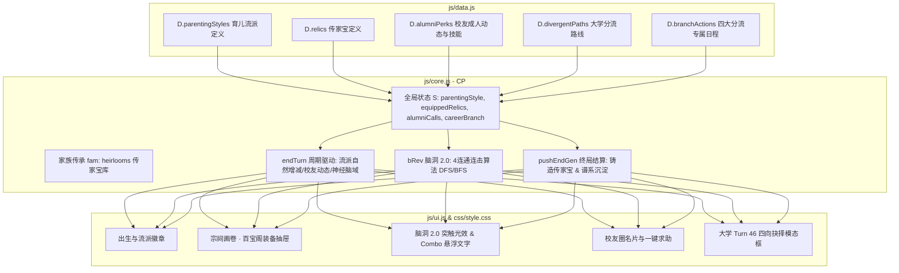

# 31. 《中国式家长》v2.7 核心系统开发规范与架构规约 (Technical Specification)

> 文档版本: v2.7.0-DEV  
> 责任角色: 游戏开发工程师 (Game Developer)  
> 适用工程: `chinese-parent` H5 纯前端单页架构  
> 更新日期: 2026-10-08  

---

## 目录
1. [系统总体架构与数据流](#一系统总体架构与数据流)
2. [数据层规约 (`js/data.js`)](#二数据层规约-jsdatajs)
3. [核心逻辑与状态机模型 (`js/core.js`)](#三核心逻辑与状态机模型-jscorejs)
4. [界面渲染与交互驱动 (`js/ui.js`)](#四界面渲染与交互驱动-jsuijs)
5. [样式与动画表现 (`css/style.css`)](#五样式与动画表现-cssstylecss)
6. [向下兼容与存档自动迁移契约](#六向下兼容与存档自动迁移契约)
7. [质量保障与回归测试矩阵](#七质量保障与回归测试矩阵)
8. [多轮自主开发排期规划 (Roadmap & Schedule)](#八多轮自主开发排期规划-roadmap--schedule)

---

## 一、 系统总体架构与数据流

v2.7 在保持无外部运行时依赖、纯原生 JavaScript (ES6+)、`localStorage` 自动持久化、无头沙箱可测试的基础上，对核心状态树（State Schema）与生命周期钩子进行系统性扩充。



---

## 二、 数据层规约 (`js/data.js`)

### 2.1 育儿流派表 (`D.parentingStyles`)
```javascript
parentingStyles: [
  {
    id: 'tiger',
    name: '严父虎妈',
    icon: '📚',
    motto: '“少壮不努力，老大徒伤悲！”',
    desc: '学业日程行动点消耗-1，考试冲刺加成+25%，自然压力+5/回，禁绝娱乐索取。',
    actDiscountKinds: ['learn'],
    actDiscountVal: 1,
    turnStressMod: 5,
    examBuffBonus: 25,
    begFavor: { learn: 0.35, play: -1.0 }
  },
  {
    id: 'buddhist',
    name: '佛系散养',
    icon: '🍃',
    motto: '“健康开心就好，平淡是福。”',
    desc: '自然压力-8/回，阴影封顶60绝不崩溃，体魄成长+20%，每月零花钱-20%。',
    turnStressMod: -8,
    shadowCap: 60,
    phyGrowthBonus: 0.2,
    moneyRatio: 0.8,
    begFavor: { play: 0.30 }
  },
  {
    id: 'elite',
    name: '卷王世家',
    icon: '⭐',
    motto: '“要么不做，要做就必须第一！”',
    desc: '开局面子+50，开局零花钱+120，对决与选秀战力+25%，考试选秀非前列满意度-25。',
    initFace: 50,
    initMoney: 120,
    combatDamageRatio: 1.25,
    begFaceThresholdAdd: 25
  },
  {
    id: 'democratic',
    name: '民主知心',
    icon: '🤝',
    motto: '“我们永远是你最坚实的后盾。”',
    desc: '行动力上限+20，情商魅力成长+15%，满意度保底50，索取失败无心理阴影。',
    maxActBonus: 20,
    socialGrowthBonus: 0.15,
    minSat: 50
  }
]
```

### 2.2 传家宝典籍表 (`D.relics`)
```javascript
relics: [
  { id: 'relic_bike', n: '先祖的二八大杠', icon: '🚲', r: 3, desc: '行动力上限+30，每回合行动力恢复+10', perk: { maxAct: 30, actRegen: 10 } },
  { id: 'relic_paper', n: '黄冈状元手抄密卷', icon: '📜', r: 4, desc: '学习掌握度速度+25%，考分基础加成+350', perk: { learnSpeed: 0.25, examBase: 350 } },
  { id: 'relic_stock', n: '首富的原始股凭单', icon: '📈', r: 4, desc: '成年工资与分红+40%，开局压岁钱+150', perk: { salaryRatio: 0.4, seedMoney: 150 } },
  { id: 'relic_racket', n: '妈妈的双喜乒乓拍', icon: '🏓', r: 3, desc: '体魄+35，面子对决反弹伤害+40%', perk: { phy: 35, reflectRatio: 0.4 } },
  { id: 'relic_camera', n: '老海鸥胶片单反', icon: '📷', r: 3, desc: '想象魅力+30，选秀默认保底赠送1盏绿灯', perk: { img: 30, cha: 30, freeShowLight: 1 } },
  { id: 'relic_scarf', n: '青梅竹马手织围巾', icon: '🧣', r: 4, desc: '情商+35，全员初始好感+20，相亲求婚必成', perk: { eq: 35, initAff: 20, marryGuaranteed: true } },
  { id: 'relic_medal', n: '三道杠大队长红臂章', icon: '🎖️', r: 3, desc: '家庭面子开局+50，竞选演说基础得票+30%', perk: { face: 50, electionVoteRatio: 0.3 } },
  { id: 'relic_teapot', n: '祖传紫砂养生壶', icon: '🍵', r: 3, desc: '每回合压力自然消除+10，阴影恶化率-50%', perk: { stressRelief: 10, shadowMitigate: 0.5 } }
]
```

### 2.3 校友成年档案与技能表 (`D.alumniPerks`)
涵盖 7 位高中同窗在大学及职场的职业身份、常驻位置与专属交互技能。

### 2.4 大学四大分流路线与专属日程 (`D.divergentPaths` & `D.branchActions`)
涵盖学术深造、选调考公、科技创业、行业领军四大路线及其 8 门高阶专精日程配置。

---

## 三、 核心逻辑与状态机模型 (`js/core.js`)

### 3.1 状态模型扩展
在 `S` 中新增：
```javascript
S.parentingStyle = 'tiger'; // 'tiger' | 'buddhist' | 'elite' | 'democratic'
S.equippedRelics = [];      // 数组，存储佩戴的传家宝 ID，长度 <= 2
S.alumniCalls = {};         // 记录本回合已呼叫的校友 ID，每回合清空
S.careerBranch = null;      // null | 'academia' | 'civil' | 'startup' | 'corporate'
```
在家族世代总数据 `S.fam` / `loadFam()` 中新增：
```javascript
fam.heirlooms = []; // 存储家族已解锁的所有传家宝 ID 列表
```

### 3.2 育儿流派生命周期与被动生效
1. **生成时机**：`newGame()` 中通过 `rollParentingStyle(fam)` 计算并存入 `S.parentingStyle`；
2. **日程扣费结算**：`addSlot` 与 `applyAct` 校验流派折扣（若为虎妈且 `s.kind === 'learn'`，消耗行动点 -1）；
3. **回合驱动**：`endTurn()` 执行流派的 `turnStressMod` 自然压力修正及满意度保底。

### 3.3 传家宝百宝阁操作接口
- `CP.heirlooms.list()`: 获取当前家族已拥有的全部传家宝列表及佩戴状态；
- `CP.heirlooms.equip(id)`: 佩戴传家宝（数量上限 2 件），返回成功状态；
- `CP.heirlooms.unequip(id)`: 卸下传家宝；
- `CP.heirlooms.equipped()`: 获取当前已佩戴的传家宝对象列表。

### 3.4 脑洞 2.0：4 连通同色连击算法 (Synaptic DFS/BFS)
```javascript
function evalBrainCombos(g, centerIdx) {
  const target = g[centerIdx];
  if (!target || !target.t || target.t === 'bomb' || target.t === 'key') return { count: 1, cells: [centerIdx] };
  const visited = new Set();
  const queue = [centerIdx];
  visited.add(centerIdx);

  while (queue.length > 0) {
    const cur = queue.shift();
    const r = Math.floor(cur / 6), c = cur % 6;
    const neighbors = [
      r > 0 ? cur - 6 : -1,
      r < 5 ? cur + 6 : -1,
      c > 0 ? cur - 1 : -1,
      c < 5 ? cur + 1 : -1
    ];
    for (const nb of neighbors) {
      if (nb >= 0 && !visited.has(nb) && g[nb] && g[nb].open) {
        if (g[nb].t === target.t) {
          visited.add(nb);
          queue.push(nb);
        }
      }
    }
  }
  return { count: visited.size, cells: Array.from(visited) };
}
```

### 3.5 校友圈援助处理
- `CP.alumni.list()`: 获取当前阶段校友名单、职业与可用技能；
- `CP.alumni.call(npcId)`: 发起校友技能援助，扣除对应资源并生效增益。

### 3.6 大学分流与创业融资对决
- Turn 46 自动推入 `crossroad` 模态事件；
- `CP.resolve(branchIdx)` 绑定 `S.careerBranch` 并刷新高阶日程池；
- Turn 52 创业分支触发投资路演对抗，利用卡牌博弈计算估值。

---

## 四、 界面渲染与交互驱动 (`js/ui.js`)

1. **首页与出生呈现**：顶栏与出生介绍弹窗中动态渲染当前家庭的「育儿流派印章」；
2. **宗祠百宝阁界面**：在「宗祠 / 谱系」标签页中新辟「百宝阁」卡片抽屉，支持图鉴查看与佩戴勾选；
3. **脑洞 2.0 动效**：格子被点击触发连击时，根据连击数（2连击、3~4连共振、5+全脑爆发）在格子上弹出悬浮飘字及金色光斑；
4. **校友圈面板**：大学与职场期在社交页面上方呈现「校友圈人脉动态」卡片与援助按钮；
5. **大学人生十字路口弹窗**：四向卡片对比排版，附带详细路线前景描述。

---

## 五、 样式与动画表现 (`css/style.css`)

- `.style-badge`: 育儿流派徽章（国风印章质感，金红边框）；
- `.relic-grid`, `.relic-card`: 百宝阁传家珍宝金玉展示卡，配备佩戴中高亮微光；
- `.brain-combo-bubble`: 神经突触连击浮动数字与流光动效；
- `.alumni-card`: 校友圈精致名片排版；
- `.crossroad-grid`: 四向抉择卡片，带悬停上浮与脉冲光晕。

---

## 六、 向下兼容与存档自动迁移契约

在 `resume()` 中增加自愈逻辑：
```javascript
if (!S.parentingStyle) S.parentingStyle = 'democratic';
if (!Array.isArray(S.equippedRelics)) S.equippedRelics = [];
if (!S.alumniCalls) S.alumniCalls = {};
if (S.fam && !Array.isArray(S.fam.heirlooms)) S.fam.heirlooms = [];
```
确保任何 v1.x/v2.x 历史存档载入时 100% 正常运行，不发生白屏或抛出异常。

---

## 七、 质量保障与回归测试矩阵

自动化回归测试套件 `tests/test_v27_features.js` 必须覆盖：
1. 育儿流派 4 种类型全额生效断言（行动点消耗减免、考试加成、压力扣减、索取偏好）；
2. 传家宝铸造、佩戴上限 2 件、属性与被动技能全生命周期生效断言；
3. 脑洞 2.0 突触 4 连通算法正确性、倍率计算与全脑风暴行动点返还；
4. 7 位校友在大学/职场期的成年职业判定与援助技能扣费与属性赋予；
5. 大学第 46 回合人生十字路口四向分流、日程注入与终局职业闭环；
6. 10 代全随机混沌策略无头压力测试零报错零死锁验证。

---

## 八、 多轮自主开发排期规划 (Roadmap & Schedule)

按工程实施拆分为 **5 个交付轮次 (Sprint Rounds)**：

| 轮次 | 阶段代号 | 核心交付内容 | 验收测试重点 | 交付目标 |
|:---:|:---|:---|:---|:---:|
| **Round 1** | **CORE-STYLE-RELIC** | 模块1（育儿流派系统） + 模块2（传家宝百宝阁系统） | 流派被动计算、索取修正、传家宝佩戴与世代继承 | 基础代际层闭环 |
| **Round 2** | **SOC-ALUMNI** | 模块3（同窗校友圈动态与成人期人脉网络） | 校友职业演化、援助技能消耗与收益、防刷控制 | 社交成人期闭环 |
| **Round 3** | **BRAIN-COMBO** | 模块4（脑洞 2.0 突触连击算法与阶段脑域） | 4连通连击判定、倍率运算、行动力返还、动效呈现 | 脑洞玩法升级 |
| **Round 4** | **LIFE-CROSSROAD** | 模块5（大学四向深造分支与成人期深度人生岔路） | Turn 46 模态抉择、四大分支高阶日程、终局新职业成就 | 成人期深度闭环 |
| **Round 5** | **INTEG-RELEASE** | 全系统联调、UI视觉精修、自动化全套压力测试、升级发布 | `npm test` 全绿通过、代码提交与发布交付 | v2.7.0 正式交付 |

---
*规范编制完成，可依据排期立即启动多轮自主编码与交付。*
