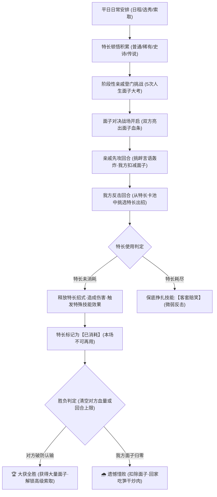

# 32. 原版还原·面子对决系统游戏玩法深度设计文档 (Faithful Face Duel Design)

> **对应版本**：v2.8.0+  
> **设计目标**：深度剖析并最大程度还原《中国式家长》原版“面子对决（Face Battle）”核心精髓。将原版“亲戚登门攀比、面子生命值博弈、特长一次性出战消耗、特长品阶战力压制、见招拆招攻防回击、面子索取成长闭环”等灵魂机制原汁原味还原，并融合本土化现代审美与沉浸式戏剧互动。

---

## 一、 系统定位与中国式人情世故哲学

### 1.1 文化背景与精神内核
“面子对决”是《中国式家长》最具代表性的神来之笔：
- **中国式亲戚社交修罗场**：逢年过节走亲访友、升学酒席、大院偶遇，亲戚长辈之间表面看似喜笑颜开、客客气气，实则暗藏机锋。每一次对话都是以孩子为武器的无声较量（“我家小宝三岁就会背唐诗”、“我家孩子这次期末又是全区第一”）。
- **攻防主体的艺术隐喻**：
  - 战斗前线是**妈妈与亲戚**的唇枪舌剑；
  - 战斗弹药是**主角平时在日常日程中领悟的各项特长**；
  - 战斗血条是**双方家庭的面子（Face HP）**。
- **日常积累的终极阅兵**：面子对决不仅是一场小游戏，更是玩家平日里“劳逸结合、定向培养、特长收集”的阶段性大考。

---

## 二、 核心还原要素与机制矩阵 (Faithful Pillars)

### 2.1 原版五大阶段性亲戚阵容 (The 5 Classic Relative Rivals)

原版在角色一生中设有 5 次标志性的亲戚攀比，难度随成长阶段递增，每位亲戚拥有独特的面子血量、攻击风格与口癖台词：

| 场次 | 人生阶段 | 推荐回合 | 亲戚身份与代号 | 头像 | 面子血量 (HP) | 攻击力 | 核心炫耀流派 | 经典挑衅语录 |
|:---:|:---:|:---:|:---|:---:|:---:|:---:|:---|:---|
| **第1场** | 幼儿园期 | Turn 12 | **表嫂** (`biaosao`) | 👩 | 60 点 | 15~22 | **早教优越流** | “我家小宝刚报了双语早教班，全外教教学呢！” |
| **第2场** | 小学初期 | Turn 20 | **二姨** (`eryi`) | 👱‍♀️ | 90 点 | 22~30 | **才艺培训流** | “女孩子嘛，气质最重要，我家孩子芭蕾都考过三级了！” |
| **第3场** | 初中初期 | Turn 28 | **二舅妈** (`erjiuma`) | 👵 | 130 点 | 30~42 | **学科奥数流** | “这次期中考全市统考，我家天天又是全校前三！” |
| **第4场** | 高中初期 | Turn 36 | **周阿姨** (`zhouayi`) | 👩‍🦱 | 180 点 | 40~55 | **综合素质流** | “钢琴十级算什么，上周刚作为学生代表去省里汇报演讲！” |
| **第5场** | 高考前夕 | Turn 42 | **大姑** (`dagu`) | 👵‍🦳 | 240 点 | 55~75 | **名校保送流** | “听说隔壁谁家孩子还在苦读，我家孙子常青藤面试都过了！” |

---

### 2.2 核心机制一：特长“单场单次消耗制” (Single-Use per Battle)
**这是原版面子对决最关键的策略灵魂所在！**
1. **特长出战池**：进入对决时，玩家平生掌握的所有特长（或至多精选前 6~8 张）悉数陈列于技能栏中；
2. **一次性出战**：每个特长在同一场对决中**只能使用 1 次**；
3. **已用状态置灰**：出招后该特长立即变灰锁定，不可重复出击；
4. **特长深度考量**：
   - 面对 180~240 血量的大姑、周阿姨，单靠一张传说特长打 90 伤根本无法秒杀；
   - 玩家必须合理规划特长释放次序（先用稀有特长削血，再用史诗特长斩杀，或先用防御技能抗住第一波高伤）；
5. **保底技能【客套赔笑】**：
   - 当玩家所有特长皆已耗尽、或早期未学会任何特长时，系统提供唯一的保底招式：
   - 效果：“客套笑脸相迎，勉强辩解两句”，造成小额固定伤害（8~15 点），但无法获得暴击加成。

---

### 2.3 核心机制二：特长品阶与战斗力体系 (RATK & Combat Effects)
原版中特长严格划分为四阶品质，品质越高，基础战斗力与面子杀伤力呈几何级跃迁：

| 品阶代号 | 品阶名称 | 稀有度颜色 | 原版战斗力标称 | 面子对决伤害区间 | 附加战斗特效 (Skill Effect) |
|:---|:---|:---:|:---:|:---:|:---|
| **Rank 1** | **普通特长** (Common) | 绿色 (`#4caf50`) | 7 | 15 ~ 25 点 | **稳定输出**：中规中矩的日常小才华（如：学狗叫、翻跟头） |
| **Rank 2** | **稀有特长** (Rare) | 蓝色 (`#2196f3`) | 14 / 49 | 35 ~ 50 点 | **概率暴击**：35% 几率造成 1.5 倍震撼打击（如：折纸达人、少儿心算） |
| **Rank 3** | **史诗特长** (Epic) | 紫色 (`#9c27b0`) | 21 / 343 | 65 ~ 95 点 | **破防削弱**：造成高额伤害的同时，使对手下回合攻击力下降 40%（如：浪里白条、小作文战神） |
| **Rank 4** | **传说特长** (Legend) | 金色 (`#ff9800`) | 28 / 2401 | 120 ~ 180 点 | **一击必杀/震撼全场**：毁灭级降维打击，无视防御，若打出必定触发全场惊呼动效！（如：五指琴魔、数学考霸） |

---

### 2.4 核心机制三：回合格斗节奏（亲戚挑衅先攻 -> 妈妈见招拆招）
原版的交锋流程充满生活气息：
1. **亲戚先攻（回合起始）**：
   - 亲戚头顶弹出挑衅气泡（如：“表嫂：哎呀不是我说，现在的孩子光知道玩，哪像我们天天报了三门名师课！”）；
   - 亲戚发动【言语攻势】，伴随攻击动画，我方扣减相应面子值；
   - 屏幕晃动并弹出飘字伤害；
2. **妈妈反击（玩家回合）**：
   - 轮到我方反击，界面提示“请选择展示哪项特长让亲戚开开眼！”；
   - 玩家点击未消耗的特长技能卡；
   - 我方展示特长卡牌大图，老妈配合打出犀利回怼台词（如：“老妈：哪里哪里，小孩子平时就喜欢弹弹琴，顺便拿了个全国金奖罢了～”）；
   - 对手被击中，扣减面子值，露出尴尬/吃惊表情；
3. **老妈护犊心切机制（满怒必杀）**：
   - 当我方受到重击、或者战局焦灼至后期时，老妈怒气累积满 100%；
   - 点亮额外【老妈亲下场助威】必杀技（全家王牌），不消耗特长卡，造成关键救场爆发！

---

## 三、 闭环激励：面子与索取系统的正向飞轮

在《中国式家长》中，面子对决不是孤立的战斗，而是核心资源【面子（Face）】的最大爆发产出来源：
1. **胜负收益**：
   - **大获全胜**：家庭面子大幅增长 **$+80 \sim +150$** 点，心情 **$+15$**，父母满意度上升；
   - **败下阵来**：家庭面子扣除 **$-30 \sim -50$** 点，老妈叹气回家唠叨；
2. **解锁索取门槛**：
   - 赢下面子对决后，玩家的面子值迅速达到 200 / 300 / 500 大关；
   - 解锁向父母索取高阶道具：如【橡皮泥】（特长：捏泥大师）、【电子琴】（特长：五指琴魔）、【黄冈密卷】（特长：高考全科提分）；
   - 这些道具在后续回合转化为更高级别特长，形成势不可挡的良性成长闭环！

---

## 四、 视听与沉浸式交互规范

1. **对峙舞台布局**：
   - 左侧为【我方阵营】：妈妈头像 + 主角立绘 + 我方面子血条 + 老妈怒气；
   - 右侧为【亲戚阵营】：亲戚立绘 + 亲戚头衔 + 亲戚面子血条 + 挑衅台词气泡；
   - 中央为交锋战况播报滚动栏；
   - 底部为【特长技能卡槽】：横向平铺展示当前特长卡片，支持滚动，清晰显示卡牌图标、品质金边、技能战力及“已使用”印章。
2. **动效反馈**：
   - 受到暴击时全屏微震；
   - 扣血时上方跳出红色/绿色动态浮动飘字；
   - 对方败退时触发“灰溜溜借故退场”专属幽默动画。
