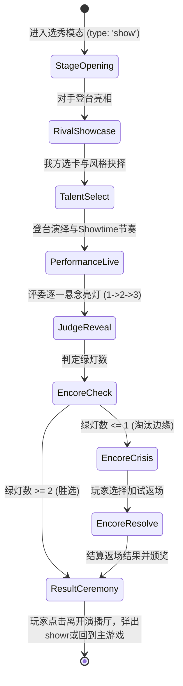

# 🎪 特长才艺选秀大会 3.0 (Talent Grand Show 3.0) 技术规范规约

> **版本**：v3.0.0  
> **状态**：已批准实装 (Ready for Implementation)  
> **关联策划**：[`docs/36_talent_show_faithful_gameplay.md`](file:///d:/github/chinese-parent/docs/36_talent_show_faithful_gameplay.md)

---

## 一、系统架构与数据模型

### 1.1 选秀挂起状态对象 (`S.pending[i]` 契约)
选秀触发时生成结构体，挂入 `S.pending` 队列：

```typescript
interface TalentShowPendingState {
  type: 'show';
  tier: 1 | 2 | 3 | 4;                // 1: 幼年, 2: 小学, 3: 初中, 4: 高中
  title: string;                      // 如："🎨 区少年宫新星才艺大奖赛"
  body: string;                       // 背景说明
  lv: number;                         // 同 tier
  judges: Array<{                     // 三大评委规范
    id: 'zhang' | 'mike' | 'li';
    name: string;                     // "张教授" | "麦克老师" | "李主任"
    icon: string;                     // "🧐" | "🕶️" | "👩‍🏫"
    title: string;                    // 称号头衔
    style: string;                    // 偏好风格简述
    motto: string;                    // 评委座右铭
  }>;
  rival: {
    name: string;                     // "三年二班陈同学"
    quote: string;                    // 对手登场台词
    talent: {
      id: string;
      n: string;
      icon: string;
      r: number;                      // 1 ~ 4
      atk: number;                    // 基础战力 7^r
      cat: 'stem' | 'art' | 'phy' | 'witty';
    };
  };
  opts: string[];
}
```

### 1.2 演出交互参数与判定契约 (`talentShowPerform`)

```typescript
interface TalentShowPerformParams {
  chosenTalentId: string;             // 我方出战特长 ID
  styleChoice: 'steady' | 'showtime' | 'witty'; // 三大表演风格
  showtimeGrade?: 'perfect' | 'good' | 'normal'; // Showtime 卡点评级
  encoreChoice?: 'speech' | 'second_talent';     // 返场决断
  secondTalentId?: string;           // 第二特长 ID
}

interface TalentShowResultModal {
  type: 'showr';
  tier: number;
  title: string;
  win: boolean;
  greenCount: number;                 // 0 ~ 3
  lights: [boolean, boolean, boolean];// 张教授, 麦克老师, 李主任
  styleChoice: string;
  showtimeGrade: string;
  encoreTriggered: boolean;
  encoreSuccess: boolean;
  judgeQuotes: [string, string, string];
  danmaku: string[];
  mine: TalentItem;
  rival: RivalInfo;
  gi: number;                         // 获得悟性
  gf: number;                         // 获得面子
  body: string;
}
```

---

## 二、评委打分方程与概率模型

### 2.1 基础战力差胜率基准 $P_{\text{base}}$
$$
P_{\text{base}} = \begin{cases}
0.72 + (R_{\text{mine}} - R_{\text{rival}}) \times 0.18, & \text{若 } R_{\text{mine}} \ge R_{\text{rival}} \\
0.28 - (R_{\text{rival}} - R_{\text{mine}}) \times 0.12, & \text{若 } R_{\text{mine}} < R_{\text{rival}}
\end{cases}
$$
受区间限制 $\text{clamp}(P_{\text{base}}, 0.10, 0.92)$。

### 2.2 表演风格与评委偏好修正 $\Delta P_{j}$
针对三位评委（张教授 $j_1$、麦克老师 $j_2$、李主任 $j_3$）：

1. **张教授（资深老学究）**：
   $$
   \Delta P_1 = (\text{cat} = \text{'stem'} ? +0.22 : 0) + (R \ge 3 ? +0.15 : 0) + (\text{style} = \text{'steady'} ? +0.20 : 0) - (\text{cat} = \text{'witty'} ? -0.16 : 0)
   $$
2. **麦克老师（前卫潮人导师）**：
   $$
   \Delta P_2 = (\text{cat} \in \{\text{'art'}, \text{'phy'}\} ? +0.20 : 0) + (\text{style} = \text{'showtime'} ? +0.22 : 0) + (\text{grade} = \text{'perfect'} ? +0.18 : 0)
   $$
3. **李主任（德育亲和导师）**：
   $$
   \Delta P_3 = (\text{style} = \text{'witty'} ? +0.22 : 0) + (\frac{\text{EQ}}{200} \times 0.12) + (R = 1 ? +0.15 : 0) + 0.10
   $$

最终每位评委亮灯判定：
$$
P(L_j = \text{true}) = \text{clamp}(P_{\text{base}} + \Delta P_j, 0.05, 0.98)
$$

### 2.3 绝活返场 (Encore) 判定模型
若 $\sum L_j \le 1$ 且玩家选择返场：
* **选择成长心路演讲**：
  $$
  P_{\text{encore}} = \text{clamp}(0.60 + \frac{\text{EQ}}{300} + (\text{style} = \text{'witty'} ? 0.12 : 0), 0.40, 0.88)
  $$
* **选择第二特长升华**：
  $$
  P_{\text{encore}} = \text{clamp}(0.55 + R_{\text{second}} \times 0.10, 0.45, 0.95)
  $$
成功时，随机将一盏未亮绿灯反转为亮起：$L_k = \text{true}$。

---

## 三、时序安全与防插队状态机



**关键安全锁**：
在整个选秀模态运行生命周期内，所有可能由回合自然流转产生的外围通知、随机成长事件，统一存入队列暂存，直至玩家在 `renderTalentShowResultModal` 中点击“🏆 携金杯凯旋”后，方平滑放行下一个 `pending` 模态，彻底根绝事件插队！
