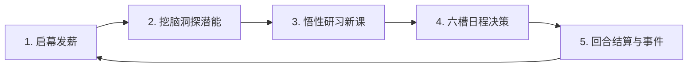

# 《中国式家长》H5 版 — 详尽游戏设计大典 (Complete Game Design Document)

> 版本：v1.0 权威扩充版  
> 线上体验地址：https://chinese-parent.pages.dev  
> 开源仓库：https://github.com/hufengxiao/chinese-parent  
> 原作致敬：墨鱼玩游戏《中国式家长》(Chinese Parents, 2018)

---

## 目录 (Table of Contents)

1. [第0章 项目定位与设计哲学](#第0章-项目定位与设计哲学)
2. [第1章 玩法总览与核心循环](#第1章-玩法总览与核心循环)
3. [第2章 人生阶段与回合时钟](#第2章-人生阶段与回合时钟)
4. [第3章 数值模型与代际遗传系统](#第3章-数值模型与代际遗传系统)
5. [第4章 挖脑洞玩法设计](#第4章-挖脑洞玩法设计)
6. [第5章 日程安排与智能排满算法](#第5章-日程安排与智能排满算法)
7. [第6章 课程技能树与特长图鉴系统](#第6章-课程技能树与特长图鉴系统)
8. [第7章 事件抉择系统与题库全书](#第7章-事件抉择系统与题库全书)
9. [第8章 面子对决系统](#第8章-面子对决系统)
10. [第9章 特长选秀大会](#第9章-特长选秀大会)
11. [第10章 经济系统、校园小卖部与索取机制](#第10章-经济系统校园小卖部与索取机制)
12. [第11章 考试升学与高考全科评分系统](#第11章-考试升学与高考全科评分系统)
13. [第12章 同学社交、好感度与婚恋相亲系统](#第12章-同学社交好感度与婚恋相亲系统)
14. [第13章 职业分支、人生功绩录与家族传承](#第13章-职业分支人生功绩录与家族传承)
15. [第14章 UI交互规范与视听系统设计](#第14章-ui交互规范与视听系统设计)
16. [第15章 研发里程碑规划与质量保障体系](#第15章-研发里程碑规划与质量保障体系)
17. [附录：原作底层核心机制对照与研究精要](#附录原作底层核心机制对照与研究精要)

---

## 第0章 项目定位与设计哲学

### 0.1 项目性质与文化初心
- **致敬原作**：个人自娱自乐开源项目，忠实复刻墨鱼玩游戏 2018 年风靡海内外的现实主义养成独立游戏《中国式家长》。
- **精神内核**：**“养一个娃，从呱呱坠地到金榜题名，再到成家立业，把一生的积淀毫无保留地传递给下一代。”** 艺术化呈现几代人通过知识拼搏改变命运、谋求“阶层跃升”的中国式家庭史诗。
- **叙事基调**：文案全量原创，以兼具幽默、自嘲、扎心与温情的笔触，提炼当代青年共同的成长印记（升旗仪式忘带红领巾、偷偷改窄校服裤脚、过年长辈推拿红包、高考百日誓师、大学通选课抢课溃败、早八地铁与深夜大饼）。

### 0.2 技术选型：极致的纯前端零依赖哲学
- **原生纯净**：抛弃一切构建打包器（Webpack/Vite）与重型前端框架，纯手写现代原生 HTML5、CSS3 与原生 ES 模块化 JavaScript。源码即交付，打开浏览器即刻秒开。
- **免后端与本地自主**：利用浏览器原生的 `localStorage` 搭建两级数据持久化架构（即时进度 `cph_save` 与家族档案 `cph_fam`），断电不丢档，离线亦可完整畅玩。
- **原生数字合成音效**：基于 HTML5 Web Audio API，利用纯数字振荡器动态实时合成按键音、弹窗音与胜利和弦，不加载任何外部笨重音频素材。
- **边缘零成本托管**：基于 Cloudflare Pages 静态边缘网络实现全球 CDN 极速分发。

### 0.3 美术风格与视觉规范
- **符号化卡通艺术**：不侵权盗用商业素材，全量运用 **Emoji 矢量符号 + CSS 渐变质感卡片** 勾勒角色与剧情场景。
- **温暖护眼色彩**：以米白暖纸为底色，点缀金黄、落霞橙与温润羊皮纸质感，追求亲切、治愈且富有文化辨识度的微拟物与扁平化融合界面。

---

## 第1章 玩法总览与核心循环

### 1.1 一句话总览
玩家扮演一个普通中国家庭出生的孩子，在长达 58 回合的人生中，每回合通过“挖脑洞”获取灵感悟性，规划“六槽日程”兼顾学习冲刺与心理减压，在亲友面子对决与特长选秀中扬眉吐气，跨越期末考、中考与高考大关，在大学中自主求索，步入职场成家立业，并最终将一生修为遗传给下一代。

### 1.2 每回合标准五步闭环 (The 5-Step Loop)

1. **启幕与发薪**：行动力刷新至基准上限（100点+状态修正）；根据家族门第阶层发放当期零花钱（30~180元）；刷新 6×6 脑洞潜能迷雾。
2. **脑洞深潜**：翻开未知脑神经格子，寻找悟性灯泡、五维属性球、连环炸弹、补能闪电以及通往下层的钥匙。
3. **悟性研习**：依据当前五维属性享受高达 $75\%$ 的打折特权，消耗悟性点亮新技能，永久解锁其进入日程池。
4. **日程博弈**：自由编排 6 个槽位（学习、娱乐、打工、休息、索取），在属性掌握度增长、满意度奖惩与学业压力之间拿捏平衡。
5. **结算与事件**：推演身心数值波动，判定日常抉择、面子对决、选秀大会或升学画卷，步入新回合。

---

## 第2章 人生阶段与回合时钟

### 2.1 8 大黄金人生阶段划分

| 阶段代码 | 阶段中文 | 回合跨度 | 年龄对应 | 核心主线目标与解锁系统 |
|:---:|:---:|:---:|:---:|:---|
| `baby` | **婴儿期** | 1 ~ 8 回合 | 0 ~ 3 岁 | 基础动作（翻身/爬行/走路/学语）、抓周大典、打疫苗，打好体魄底子 |
| `kinder` | **幼儿园** | 9 ~ 14 回合 | 3 ~ 6 岁 | 小红花、面子对决开启、才艺选秀首秀、索取心愿道具、过年红包推拉 |
| `pri` | **小学期** | 15 ~ 24 回合 | 6 ~ 12 岁 | 语数外启蒙、校园小卖部开张、竞选班干部、期末考试排座次、固定零钱 |
| `junior` | **初中期** | 25 ~ 32 回合 | 12 ~ 15 岁 | 物理化学文综、同学社交解禁（聊天送礼）、兼职打工、中考命运分流 |
| `senior` | **高中期** | 33 ~ 44 回合 | 15 ~ 18 岁 | 高三强化冲刺、选秀总决赛、百日誓师、高考综合算分大决战 (Turn 44) |
| `college` | **大学期** | 45 ~ 50 回合 | 18 ~ 22 岁 | 自由选修专业深造课程、大厂实习面试、百团大战、毕业论文终极答辩 |
| `work` | **职场期** | 51 ~ 57 回合 | 22 ~ 30 岁 | 职场月薪打卡发放、职级晋升考核、商务宴请、带薪摸鱼、买房/租房 |
| `home` | **成家立业**| 58 回合+ | 30 岁以上 | 婚恋相亲最后通牒、安家立业、全生人生功绩录评级、孕育下一代传承 |

### 2.2 7 大人生阶段成长蜕变画卷 (Phase Transitions)
在升学与转折的关键回合（9、15、25、33、45、51、58 回合），系统触发全屏沉浸式的成长蜕变画卷：

| 触发回合 | 阶段转换 | 仪式徽章 | 标题与画卷主题 | 核心解锁特权 | 阶段成长礼包 |
|:---:|:---:|:---:|:---|:---|:---|
| **Turn 9** | 婴儿 ➜ 幼儿园 | `👶 🍼 ➜ 🎒 🖍️` | **告别襁褓 · 背上小书包！** | 开启成绩小红花、首场面子对决 (T14)、登台才艺选秀 (T12)、解锁向父母索取心愿 | 悟性 $+30$，行动 $+20$ |
| **Turn 15** | 幼儿园 ➜ 小学 | `🎒 🖍️ ➜ 🏫 📝 🧣` | **系上红领巾 · 义务教育起航！** | 开启校园小卖部货架、开启每回合零花钱定时发放、解锁班干部三向竞选 (T18) 与期末考 (T24) | 悟性 $+45$，行动 $+25$，开学零花 $+30$ 元 |
| **Turn 25** | 小学 ➜ 初中 | `🏫 📝 ➜ 🏢 📚 🚲` | **青葱岁月 · 少年心事渐浓！** | 解锁同学往来社交圈（聊天送礼）、开放课外兼职打工自食其力、迎接命运中考分流 (T32) | 悟性 $+60$，行动 $+30$，青春零花 $+50$ 元 |
| **Turn 33** | 初中 ➜ 高中 | `🏢 📚 ➜ 🏛️ 🎓 🔥` | **无悔青春 · 高考终极冲刺！** | 解锁高中高阶学科、选秀巅峰争霸赛 (T40)、百日誓师、决战高考终极综合考分大关 (T44) | 悟性 $+80$，行动 $+40$，全神贯注状态 |
| **Turn 45** | 高中 ➜ 大学 | `🏛️ 🎓 ➜ 🏬 💻 🍻` | **放飞象牙塔 · 终章启幕！** | 依据高考录取梯级获得大学发展资质、自由选修专业深造课、百团大战、大厂群面实习 | 悟性 $+100$，行动 $+40$，生活费 $+100$ 元 |
| **Turn 51** | 大学 ➜ 职场 | `🏬 💻 ➜ 💼 🏢 🚗` | **告别校园 · 跻身社会大潮！** | 开启职场月薪打卡发放、职级晋升考核、商务宴请、带薪摸鱼、租房买房重大抉择 | 行动 $+40$，起步启动金 $+200$ 元 |
| **Turn 58** | 职场 ➜ 成家 | `💼 🏢 ➜ 🏡 👶 📜` | **三十而立 · 传承生命火炬！** | 开启婚恋相亲最后通牒、安家立业、全生人生功绩录评级、孕育下一代完成世代交接 | 行动 $+50$，成家基金 $+300$ 元 |

---

## 第3章 数值模型与代际遗传系统

### 3.1 六维心智属性
- **📐 智商 (iq)**：主定理科、数学、物理、计算机与医学；打折所有理科课程。
- **❤️ 情商 (eq)**：主导语文理解、社交处事、管理艺术；提升社交成功率。
- **🧠 记忆力 (mem)**：主对应试刷题、英语语法、文综政史地；降低背诵类课程门槛。
- **🎨 想象力 (img)**：主导创意写作、艺术设计、二次元创作；激发高级艺术特长。
- **💪 体魄 (phy)**：主导体测达标、精力耐力、抗疲劳性；提升抗压安全阀值。
- **⭐ 魅力 (cha)**：特殊属性（无法挖脑洞直接获得），纯靠高级课程与时尚事件获取，是演艺明星与顶级恋情的门槛。

### 3.2 动态资源与身心安全警戒线
- **学业压力 (Stress, 0~200)**：学习排满则升，娱乐休息则降；超过 85 点进入警戒区。
- **心理阴影 (Shadow, 0~100)**：当压力过大或长期遭受父母低满意训斥时以 $\Delta \text{Shadow} = \lfloor (\text{Stress}-80) \times 0.15 \rfloor + 1$ 累积。**一旦满 100 点触发精神崩溃 BE 结局**。
- **父母满意度 (Sat, 0~140)**：$\ge 80$ 点为欣慰状态，奖励宝贵索取次数与零花钱；$\le 15$ 点挨批并滋生心理阴影。

### 3.3 代际遗传与家族阶层跃升公式
1. **属性血统继承**：
   $$\text{Attr}_{\text{start}}(k) = \text{Base}(k) + \lfloor \text{ParentAttr}(k) \times 0.18 \rfloor + \text{SpouseBonus}(k)$$
2. **家族特长底蕴自然成长**：
   $$\text{PerTurnGrowth} = \max\left(1, \ \lfloor \text{AtlasCount} / 2 \rfloor\right)$$
   每回合伊始全属性自动无消耗觉醒增长。
3. **经济门第继承**：上一代最终职业地位决定后代家族阶层 Tier 0~5，基准零钱由 30 元一路跃升至 180 元/回。

---

## 第4章 挖脑洞玩法设计

### 4.1 6×6 矩阵开雾与节点类型
每回合开局生成全新的 36 格脑神经迷雾面板，单步翻开消耗 **2 点行动力**：

| 节点类型 | 标识 | 生成概率 | 基础收益效果 | 随层级加成公式 ($db = 1 + (\text{Layer}-1)\times 0.2$) |
|:---:|:---:|:---:|:---|:---|
| **💡 悟性灯泡** | `bulb` | 22.0% | 基础产出 $10 \sim 20$ 点悟性 | $\text{Round}((10 \sim 20) \times db)$，全代悟性最核心来源 |
| **🎨 单属性球** | `attr` | 24.0% | 随机五维属性 $+2 \sim 4$ 点 | $\text{Round}((2 \sim 4 + (\text{Layer}-1)) \times db)$ |
| **⚡ 补能闪电** | `bolt` | 10.0% | **回复行动力 $+10 \sim 25$ 点** | 突破体能极限，支撑长线探索 |
| **💥 范围炸弹** | `bomb` | 9.0% | **引爆周围 $3 \times 3$ 九宫格** | 连环翻开 8 格并结算收益，极高概率盲爆出钥匙 |
| **💀 脑内风暴** | `skull` | 9.0% | 五维全属性集体增加 $+2 \sim 4$ 点 | 强力当期即时加成 |
| **💰 零钱罐** | `gold` | 8.0% | 捡到零花钱 $+8 \sim 20$ 元 | 补贴家用 |
| **🦆 呆萌鸭子** | `duck` | 18.0% | “鸭子看了你一眼” | 趣味空节点 |
| **🗝️ 下层钥匙** | `key` | 固定1格 | **下探新一层，直接奖励 $+50$ 点行动力！** | 跃迁枢纽（最多可下探至第 4 层） |

---

## 第5章 日程安排与智能排满算法

### 5.1 六槽位核心行为模型
- **学习 (Learn)**：掌握度提升、满意度增加、属性增长，代价为累积压力与消耗行动力。
- **娱乐 (Play)**：大幅减压、小幅增加情商/想象，代价为消耗零用钱与降低父母满意度。
- **打工 (PayJob)**：初中起解锁，消耗行动力赚取数十至上百元现金。
- **休息 (Rest)**：大幅消除压力（$-10$点）、回复行动力。
- **索取 (Beg)**：消耗索取次数，成功可将强力乐器、游戏机永久加入家庭库存。

### 5.2 遵循原版机制：已掌握课程无限次复选
研习仅消耗一次悟性，一旦掌握，可在当回合 6 个槽位中**无限次重复选入**（例如考前 6 槽全排高考压轴数学）。支持随时撤销，绝不扣减已学技能。

### 5.3 启发式智能自动排满算法 (`autoFillSlots`)
算法通过虚拟沙箱推演未来压力与满意度，自动择优排满空槽：
1. **阶段匹配度**：当期年级课程加权 $+130$ 分，已过期的婴儿动作严厉扣减 $-260$ 分（小学初中绝不倒退排翻身）；
2. **学科去重与全面发展**：同一学科在单回合内重复排入受阶梯性扣分（$-30 / -75 / -140$），倡导五育并举；
3. **高压防崩劳逸结合调度**：当推演压力 $>75$ 点时，大幅提升娱乐与休息权重（$+90$分），强制实施劳逸结合。

---

## 第6章 课程技能树与特长图鉴系统

### 6.1 悟性研习打折公式
$$\text{Cost}(c) = \max\left(5, \ \text{Round}\left(\text{BaseInsight}(c) \times (1 - \text{Discount})\right)\right)$$
$$\text{Discount} = \text{Clamp}(\text{AttrVal}(\text{MainAttr}) \times 0.003, \ 0, \ 0.75)$$
主属性越高，研习越便宜，最高可直享 **$75\%$（两五折）** 巨额打折！

### 6.2 全量 51 门课程分布概览
- **婴儿期 (6门)**：翻身、爬行、学说话、学走路、摆弄玩具、听妈妈讲故事
- **幼儿园 (8门)**：拼音识字、数数1~100、儿歌练唱、涂鸦、幼儿园体育、搭积木、电子琴、橡皮泥
- **小学期 (12门)**：语文识字、背古诗、写日记；数学四则运算、应用题；英语字母单词、口语；自然常识、体育课、美术课、电脑入门、武侠小说
- **初中期 (12门)**：语文名著、作文进阶；数学代数函数、奥数入门；英语语法、听力；物理入门、化学入门、生物常识；历史故事、地理中国；体育中考训练
- **高中期 (10门)**：语文高考冲刺；数学压轴专题；英语高考冲刺；理综压轴、文综综合；五年高考三年模拟、黄冈密卷；艺考集训、体育专项、晚自习沉淀
- **大学期 (3门)**：高等数学线代、专业课绩点大作战、独立创作作品集

### 6.3 特长战力与全量 21 项特长明细表 (Talents)
特长战力严格遵循原版数值几何倍增：$$\text{Atk}(\text{Rank}) = 7^{\text{Rank}}$$

| 稀有度档位 | 攻击战力 | 特长标识 | 特长名称 | 图标 | 解锁来源渠道 |
|:---:|:---:|:---:|:---|:---:|:---|
| **Rank 1** (普通) | **7 点** | `tuyasha` | **小涂鸦师** | 🖍️ | 研习【涂鸦】概率领悟 |
| **Rank 1** | **7 点** | `gushiren` | **古诗背篓** | 🏮 | 研习【背古诗】概率领悟 |
| **Rank 1** | **7 点** | `danci` | **单词背篓** | 🔤 | 研习【英语单词】概率领悟 |
| **Rank 1** | **7 点** | `xiaozuojia` | **日记小作家** | ✍️ | 研习【写日记】概率领悟 |
| **Rank 1** | **7 点** | `wulidashi` | **物理小咖** | ⚡ | 研习【物理入门】概率领悟 |
| **Rank 1** | **7 点** | `shuo` | **说书先生** | 🏛️ | 研习【历史故事】概率领悟 |
| **Rank 1** | **7 点** | `jianghu` | **武侠迷** | 🗡️ | 研习【武侠小说】概率领悟 |
| **Rank 2** (稀有) | **49 点** | `qintong` | **琴童** | 🎹 | 研习【电子琴】概率领悟 |
| **Rank 2** | **49 点** | `niuba` | **捏泥巴小当家** | 🧈 | 研习【橡皮泥】概率领悟 |
| **Rank 2** | **49 点** | `aoshu` | **奥数苗子** | 💡 | 研习【代与函数】概率领悟 |
| **Rank 2** | **49 点** | `wenqing` | **文青** | 📚 | 研习【名著阅读】概率领悟 |
| **Rank 2** | **49 点** | `zuowen` | **写作小将** | 🪶 | 研习【作文进阶】概率领悟 |
| **Rank 2** | **49 点** | `xiaohuajia` | **少儿画家** | 🎨 | 研习【美术课】概率领悟 |
| **Rank 2** | **49 点** | `yishujia` | **艺术细胞** | 🎭 | 研习【艺考集训】概率领悟 |
| **Rank 2** | **49 点** | `chengxuyuan`| **代码初学者** | 💻 | 研习【电脑入门】概率领悟 |
| **Rank 2** | **49 点** | `games` | **小霸王游戏王** | 👾 | 日程【小霸王】概率领悟 |
| **Rank 2** | **49 点** | `yundong` | **运动健儿** | 🏃 | 研习【体育训练】概率领悟 |
| **Rank 3** (史诗) | **343 点** | `jiazui` | **压轴题杀手** | 🧮 | 研习【数学高考压轴】概率领悟 |
| **Rank 4** (传说) | **2401 点**| `gods` | **五指琴魔** | 🎹 | 达成高级钢琴集训后顿悟 |
| **Rank 4** | **2401 点**| `nianshen` | **捏泥成神** | 🧸 | 达成橡皮泥艺术巅峰后顿悟 |
| **Rank 4** | **2401 点**| `gaokao` | **状元苗子** | 👑 | 高考总分 $\ge 19000$ 必定领悟 |

---

## 第7章 事件抉择系统与题库全书

### 7.1 题库规模与分类覆盖
题库由原版精选扩充至 **73 组全生命周期事件**，覆盖全 8 大阶段：
- **婴儿期 (8组)**：抓周大典、接种预防针、开口第一声、辅食初体验、磨牙神功、半夜嘘嘘曲等；
- **幼儿园 (11组)**：午睡装睡、分苹果风波、小红花擂台、亲子才艺秀、胡萝卜大作战等；
- **小学期 (20组)**：忘带红领巾、水浒卡风云、蚕宝宝物语、课桌三八线、粉笔灰风暴、跳蚤市场摆摊等；
- **初中期 (17组)**：火星文签名、袖口穿线MP3、改窄裤脚、中考体测1000米、神级同桌降临等；
- **高中期 (15组)**：百日誓师、晚自习停电狂欢、翻烂的五三真题、体检背视力表、硬壳同学录等；
- **大学期 (8组)**：教务网抢课大溃败、大学宿舍卧谈会、高数期末量子突击、大厂实习群面等；
- **职场期 (7组)**：早八生死时速、深夜老板战略大饼、公司年会幸运锦鲤、S级项目重奖等；
- **成家后 (6组)**：七大姑八大姨催婚局、奇葩相亲遇险记、金秋红色炸弹、二十年同学聚餐等。

### 7.2 触发与去重引擎
每回合日程结束后，以 $45\%$ 概率从当前年龄阶段可用且未曾触发的候选池中随机抽取，单代生命周期内不复发。

---

## 第8章 面子对决系统

### 8.1 亲戚攀比与战斗机制 (`D.rivals`)
在人生的第 14、20、28、36 回合定期爆发，系统轮巡（`n % 4`）迎战四位风格鲜明的亲友对手：
- **第1场 (Turn 14)**：**王姨的学霸儿子** 🧑‍🎓（学神压制型，HP: 300，“史诗特长、奥数金牌、全科满分”）
- **第2场 (Turn 20)**：**有钱叔叔的孩子** 👦（凡尔赛型，HP: 200，“钢琴十级、双语幼儿园、名牌家教”）
- **第3场 (Turn 28)**：**隔壁刘婶的孙女** 👧（美育全能型，HP: 180，“舞蹈比赛第一、长得还好看”）
- **第4场 (Turn 36)**：**表哥家小孙子** 👶（神童启蒙型，HP: 120，“三岁背诗五十首、心算神童”）

1. **面子血量**：双方基准战斗面子 HP 设定为 400 点，展开最多 4 轮语言与特长交锋；
2. **己方特长输出**：
   $$\text{Damage}_{\text{my}} = \text{Round}\left(\text{RATK}[\text{Rank}] \times (0.9 + \text{Random}(0, 0.4))\right)$$
   若持有传说特长（战力 2401），一招制敌秒杀全场；若无特长，只能使出普通【大嗓门】（战力 7 点）。
3. **奖惩**：大获全胜家庭面子暴涨 **$+120$ 点**；战败扣减 **$-40$ 点**。

---

## 第9章 特长选秀大会

### 9.1 四大阶段舞台与海量悟性大奖
固定在人生的第 12（幼儿园）、22（小学）、30（初中）、40（高中）回合举办：
- **胜负判定**：比较玩家出战特长与随机对手特长的稀有度 Rank；
- **核心大奖**：初高中场次**夺冠直接奖赏 500 点悟性与 150 点面子**！此乃点亮高中顶级高考压轴课程的最强战略资源。

---

## 第10章 经济系统、校园小卖部与索取机制

### 10.1 校园小卖部核心商品
- **高能运动饮料 (15元)**：即刻回复行动力 $+15$ 点；
- **三年模拟 (70元)**：直接增加高考总考分 $+40$ 分；
- **深呼吸打气筒 (40元)**：强力削减压力 $-20$ 点，**高压防崩核心神药**。

### 10.2 向父母“索取”大件道具
- **满意度 $\ge 80$ 点** 获赠索取机会；
- 依据家庭面子门槛与成功率曲线（$25\% \sim 85\%$）博弈；
- 成功解锁：儿童电子琴、小霸王游戏机、全套漫画、品牌跑鞋、立式大钢琴、黄冈密卷强化版。

---

## 第11章 考试升学与高考全科评分系统

### 11.1 单科考分上限与五育并举机制
为防止单科无脑排满刷分，各学科设置科学考分上限：语文 55、数学 60、英语 42、理科 58、文科 34。单科刷满后继续排课仅增加基础属性。

### 11.2 高考终极综合算分模型 (Turn 44)
$$\text{RawScore} = (p_{\text{cn}} \times 70 + p_{\text{ma}} \times 70 + p_{\text{sc}} \times 70 + p_{\text{en}} \times 52 + p_{\text{so}} \times 46) + \text{CAttr}([\text{iq}, \text{mem}], 250) \times 5 + \text{Buff} \times 8 + \min(\text{img}, 200) \times 2$$
$$\text{GaokaoScore} = \min(20000, \ \text{Round}(\text{RawScore}))$$

### 11.3 六大高校录取门槛
- $< 6000$ 分：专科院校
- $6000 \sim 9999$ 分：普通二本
- $10000 \sim 13999$ 分：老牌一本
- $14000 \sim 16999$ 分：211 重点大学
- $17000 \sim 18999$ 分：985 名门学府
- $\ge 19000$ 分：**清华大学 / 北京大学**（全校横幅，解锁传说特长【状元苗子】）

---

## 第12章 同学社交、好感度与婚恋相亲系统

### 12.1 7 位同学 NPC 人设原型
苏软软（文静）、沈寒（高冷校队）、夏小美（开心果）、李振（热血体委）、媛媛（精致前桌）、孔德（中二天文社长）、棋子（电竞少女）。

### 12.2 从校服到婚纱 vs 家庭相亲局 (Turn 58)
- 若某位同学好感度 $\ge 60$（最高）：开启【浪漫求婚】，缔结为【校园恋人】，面子 $+40$，伴侣优异基因直接注入下一代；
- 若单身未恋爱：推入长辈相亲角，成功率依个人面子与魅力判定：
  $$\text{MarryProb} = \min\left(0.9, \ 0.35 + \text{Face} \times 0.001 + \text{Cha} \times 0.0015\right)$$

---

## 第13章 职业分支、人生功绩录与家族传承

### 13.1 五大路线全量 22 种社会阶层职业明细表

| 职业标识 | 职业名称与图标 | 社会门第 | 月薪基准 (`S.workSalary`) | 核心五维门槛准入要求 (`req`) | 对应社会阶层特征 |
|:---|:---|:---:|:---:|:---|:---|
| `j-bao` | **小区保安** 🛡️ | **Tier 0** | 180 元/回 | 综合属性 (`any`) $\ge 40$ | 尽职尽责，守护一方平安 |
| `j-fly` | **流水线工人** 🏭 | **Tier 0** | 180 元/回 | 综合属性 (`any`) $\ge 80$ | 踏实勤劳，制造业基层基石 |
| `j-zero` | **网约车司机** 🚕 | **Tier 0** | 180 元/回 | 综合属性 (`any`) $\ge 100$ | 穿行于城市车流，自食其力 |
| `j-paom` | **外卖骑手** 🛵 | **Tier 1** | 300 元/回 | 体魄 $\ge 120$，综合 $\ge 200$ | 风雨无阻，用速度换生活 |
| `j-shop` | **便利店店员** 🏪 | **Tier 1** | 300 元/回 | 综合属性 (`any`) $\ge 200$ | 温暖都市夜归人的深夜食堂 |
| `j-chugui`| **底层白领** 💻 | **Tier 1** | 300 元/回 | 智商 $\ge 200$，综合 $\ge 260$ | 敲击键盘的格子间新人 |
| `j-realtor`| **房产中介** 🏠 | **Tier 2** | 420 元/回 | 情商 $\ge 220$，魅力 $\ge 150$ | 能说会道，精通城市楼盘走势 |
| `j-cook` | **厨师** 🍳 | **Tier 2** | 420 元/回 | 体魄 $\ge 260$，想象 $\ge 150$ | 烟火人间，掌勺美味佳肴 |
| `j-tea` | **小学老师** 👩‍🏫 | **Tier 2** | 420 元/回 | 情商 $\ge 280$，记忆 $\ge 220$ | 传道受业，父母最放心的铁饭碗 |
| `j-gov` | **基层公务员** 🏛️ | **Tier 2** | 420 元/回 | 情商 $\ge 240$，记忆 $\ge 260$ | 编制体面，体制内中坚 |
| `j-nurse` | **白衣护士** 💉 | **Tier 2** | 420 元/回 | 记忆 $\ge 260$，体魄 $\ge 200$ | 救死扶伤，医护天使 |
| `j-design`| **资深设计师** 🎨 | **Tier 3** | 540 元/回 | 想象 $\ge 360$，魅力 $\ge 150$ | 审美在线，掌控视觉潮流 |
| `j-dev` | **软件架构师** 👨‍💻 | **Tier 3** | 540 元/回 | 智商 $\ge 380$，记忆 $\ge 300$ | 互联网大厂中坚，高薪敲代码 |
| `j-doctor`| **三甲主治医生** 🩺 | **Tier 3** | 540 元/回 | 智商 $\ge 400$，记忆 $\ge 380$ | 医术精湛，社会地位尊崇 |
| `j-lawyer`| **知名律师** ⚖️ | **Tier 3** | 540 元/回 | 智商 $\ge 360$，情商 $\ge 340$ | 逻辑严密，法庭雄辩之星 |
| `j-media` | **头部网红主播** 📱 | **Tier 3** | 540 元/回 | 魅力 $\ge 500$，想象 $\ge 260$ | 时代风口，粉丝千万的话题焦点 |
| `j-athl` | **职业运动员** 🏅 | **Tier 4** | 660 元/回 | 体魄 $\ge 600$ | 体能极限，为国争光的骄傲 |
| `j-sci` | **科研工作者** 🔬 | **Tier 4** | 660 元/回 | 智商 $\ge 560$，记忆 $\ge 420$ | 探索前沿科学，探求真理之光 |
| `j-pro` | **大学终身教授** 🎓 | **Tier 4** | 660 元/回 | 智商 $\ge 520$，记忆 $\ge 520$，想象 $\ge 300$ | 桃李满天下，学界泰斗 |
| `j-star` | **时代演艺明星** 🌟 | **Tier 4** | 660 元/回 | 魅力 $\ge 620$，想象 $\ge 420$，情商 $\ge 300$ | 万人空巷，璀璨闪耀荧幕 |
| `j-founder`| **独角兽创业老板** 🚀 | **Tier 4** | 660 元/回 | 情商 $\ge 400$，智商 $\ge 400$，魅力 $\ge 200$ | 商业领袖，时代风口开拓者 |
| `j-first` | **福布斯首富巨擘** 💰 | **Tier 5** | **780 元/回** (奖金+1000) | **智商780,情商500,记忆700,体魄300,魅力400,想象400 (全维度碾压)** | **金字塔顶尖传说**！登顶时代福布斯 |

### 13.2 人生功绩录总评算法
$$\text{TotalLifeScore} = \text{Round}\left(\text{JobScore} \times 0.4 + \text{MarryScore} \times 0.2 + \text{MoneyScore} \times 0.1 + \text{TalentScore} \times 0.3\right)$$
- **SSS 级（$\ge 88$分）**：家族传奇 · 光耀门楣
- **SS 级（$78 \sim 87$分）**：社会栋梁 · 傲视群雄
- **S 级（$68 \sim 77$分）**：小康体面 · 岁月静好
- **A 级（$52 \sim 67$分）**：平凡可贵 · 烟火人间
- **B 级（$< 52$分）**：负重前行 · 坚韧生长

---

## 第14章 UI交互规范与视听系统设计

### 14.1 布局与微交互创新
- 移动端 375px 基准竖屏，桌面 480px 居中自适应；
- Toast 单次消费与 $2.5\text{s}$ 独立淡出周期，彻底根除遮挡问题；
- 5步聚光灯新手引导与常驻《通关备忘录》。

### 14.2 纯原生 Web Audio 合成音效
利用纯数学正弦波、三角波实时生成 `click`、`pop`、`coin`、`brain`、`win`、`fail` 音效，免加载免外部音频文件。

---

## 第15章 研发里程碑规划与质量保障体系

### 15.1 里程碑交付情况
M0（骨架）、M1（学业与考试）、M2（经济与事件）、M3（对决与选秀）、M4（职业与代际）、M5（视听与上线）已全量达成。

### 15.2 自动化测试套件
- `tests/sim.js`：5 代人连续演进无头仿真；
- `tests/test_optimizations.js`：自动排满与 Toast 生命周期单元测试；
- `tests/test_events.js`：73 组全量事件结构与数值合法性验证。

---

## 附录：原作底层核心机制对照与研究精要

1. **五维与悟性**：属性是降低悟性成本的杠杆，先挖属性后学技能是原版核心心流。
2. **面子与战斗**：卡牌攻击严格呈 7 的次方几何倍增（7, 49, 343, 2401）。
3. **选秀与冲刺**：选秀提供天量悟性（500点），是高三学完所有冲刺课的必由之路。
4. **代际积累**：几代人的托举才能造就首富与清北状元，体现家庭传承的厚重力量。
